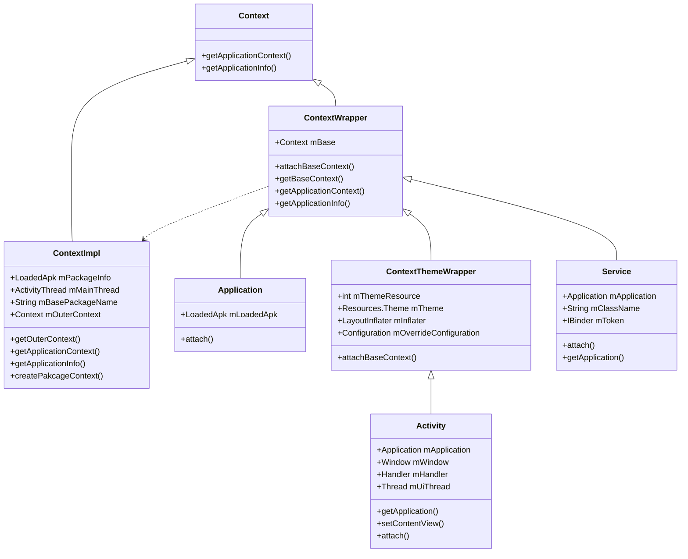

Context是**应用环境相关的全局信息接口**，它允许访问特定于应用程序的资源和类，以及对应用程序级别操作的调用。如：内部资源、包、类加载、I/O操作、权限、主线程、IPC和组件启动等操作的管理。

Context是一个抽象类，其实现类由Android系统提供，ContextImpl、Activity、Service、Application这些都是Context的直接或间接子类，Context的继承关系如下:

<!--more-->

### ContextWrapper

ContextWrapper是代理Context的实现，将其所有调用委托给另一个Context（mBase）。

Application、Activity、Service通过``attach() ``调用父类ContextWrapper的``attachBaseContext()``, 从而设置父类成员变量 mBase 为 ContextImpl 对象, ContextWrapper 的核心工作都是交给 mBase(ContextImpl) 来完成，这样可以子类化 Context 以修改行为而无需更改原始 Context。

