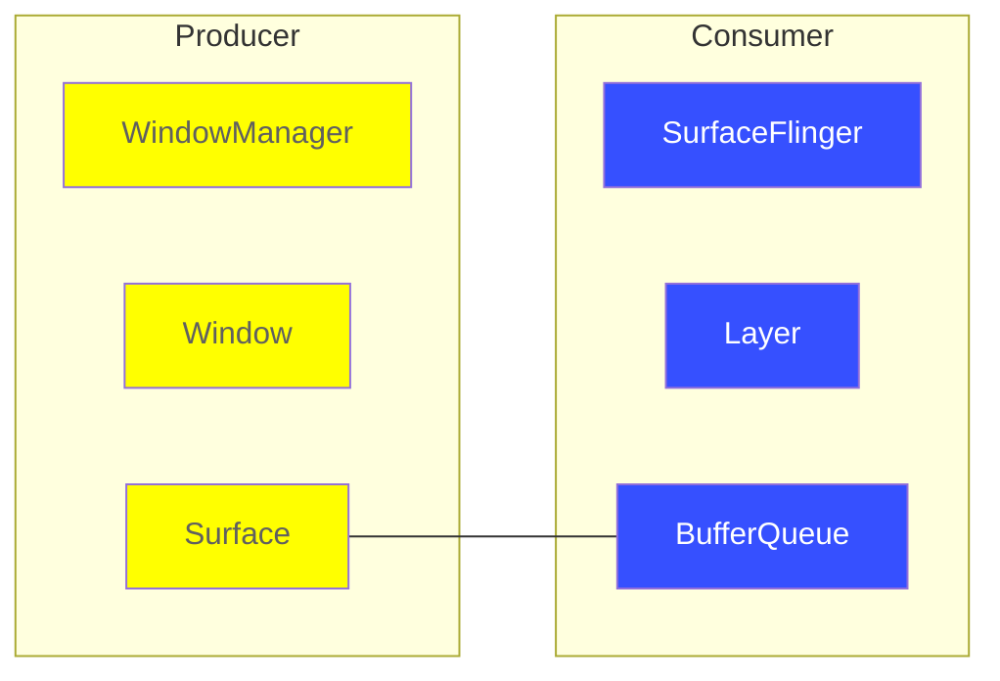
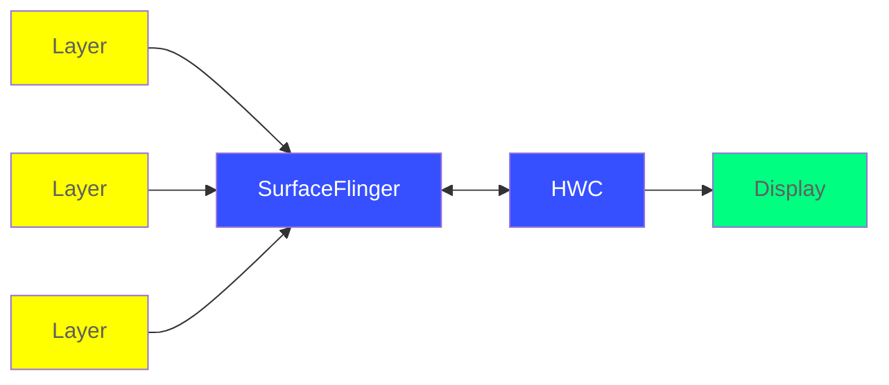
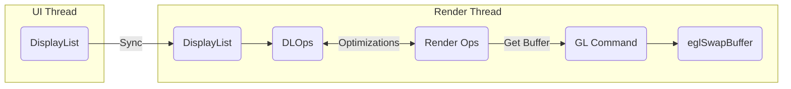

Android图形架构从架构组件到屏幕刷新机制，来认识一个图像数据是如何在图形架构中流转，最后显示到屏幕上的。增强我们对图像架构原理的理解。

<!--more-->

## 背景

### 显示器基础知识

一般在典型显示系统中包括CPU、GPU、Display，CPU负责计算帧数据，把计算结果交给GPU，GPU对图形数据进行渲染，渲染完成后放到BufferQueue（图像缓冲区），然后Display负责把图像缓冲区里的数据合成到屏幕。

### 屏幕刷新率

屏幕每秒钟的周期性变动的重复次数，单位是Hz（赫兹），即一秒内显示了多少帧的图像。

### Frame Rate（帧率）

表示GPU在一秒之内绘制操作的帧数，单位fps。

### Screen Tearing（画面撕裂）

当屏幕刷新速率是固定时，最理想的情况下帧率和屏幕刷新速率保持一致，没绘制完一帧，显示就显示一帧，但CPU/GPU写数据时不可控的，所以会出现BufferQueue里有些数据没显示出来就被覆盖了，而屏幕时不知道BufferQueue的状态的，它只负责从BufferQueue中取出帧数据合成到屏幕上，因此当出现图像数据来之不同的帧时，就出现了画面撕裂。

## 概览

Android平台中可以通过三种方式将图像绘制到屏幕上：Canvas、OpenGL ES、Vulkan，但无论使用哪种渲染API，一切内容都会渲染到Surface中。在Android平台上创建的每个Window都由Surface提供支持。所有被渲染可见的Surface都会被SurfaceFlinger合成到屏幕。

下图展示了Android关键的图形组件之间的协同工作：

## Low-level components

### BufferQueue

BufferQueue是将缓冲池和队列相结合的一种数据结构，可以将图形数据缓冲区的组件（生产者）连接到接收数据以便进行系那是或进一步处理的组件（消费者），同时它使用Binder IPC实现，可以跨进程传递。

下面来看下BufferQueue从生产者到消费者的处理过程：

1. 当生产者需要缓冲区时，通过调用`dequeueBuffer()`从BufferQueue中请求一个可用的缓冲区；
2. 生产者填充缓冲区并通过调用`queueBuffer()`将缓冲区返回到队列；
3. 消费者通过`acquireBuffer()`获取该缓冲区并使用里面的内容；
4. 当消费者操作完成后，会通过调用`releaseBuffer()`将缓冲区返回到队列；

### Gralloc

Gralloc图形内存分配器是通过HAL接口实现，将用于缓冲区中分配图像生产方请求的内存。

### Surface

Surface对象使应用能够渲染要显示在屏幕上的图像。Surface可生成一个通常由SurfaceFlinger使用的缓冲区队列。当渲染到Surface上时，结果最终将出现在传送给消费者的缓冲区中。

### SurfaceFlinger

SurfaceFlinger是图像流的消费者，SurfaceFlinger可以接受多个源的数据缓冲区，它会消耗当前可见的Surface，并使用窗口管理器中提供的信息（Window Metadata）合成到屏幕。

SurfaceFlinger可通过两种方式接受缓冲区：BufferQueue和SurfaceControl。

### SurfaceFlinger接收缓冲区的过程

当应用进入前台时，它会从WindowManager请求缓冲区，WindowManager会从SurfaceFlinger请求Layer，SurfaceFlinger创建Layer并将其发送至WindowManager，WindowManager将Surface发送至应用，但会保留SurfaceControl来操控应用在屏幕上的外观。

### Layer

Layer是Surface和SurfaceControl的组合，是合成的重要单元，每个Layer都有一组属性，用于定义它与其他层的交互方式。

| 属性 | 说明                                                         |
| ---- | ------------------------------------------------------------ |
| 定位 | 定义Layer在其屏幕上的显示位置。 包括Layer边缘的位置及其相对于其他Layer的 Z 顺序（指示该层在其他层之前还是之后）等信息。 |
| 内容 | 定义应如何在定位属性定义的边界内呈现Layer上显示的内容。 包括诸如剪裁（用来扩展内容的一部分以填充Layer的边界）和转换（用来显示旋转或翻转的内容）等信息。 |
| 合成 | 定义Layer应如何与其他Layer合成。 包括混合模式和用于 [Alpha 合成](https://en.wikipedia.org/wiki/Alpha_compositing#Alpha_blending)的全Layer Alpha 值等信息。 |
| 优化 | 提供对于正确合成Layer并非绝对必要但可由硬件混合渲染器 (HWC) 设备用来优化合成执行方式的信息。 包括Layer的可见区域以及Layer的哪个部分自上一帧以来已经更新等信息。 |

### HardwareComposer

硬件混合渲染器（HardwareComposer, HWC）是硬件抽象层（HAL）中显示子系统的硬件抽象实现，通常由显示硬件的设备制造商（OEM）来完成。主要**用于决策可用硬件合成缓冲区的有效方法，如果没有可用硬件则返回SurfaceFlinger处理**。

SurfaceFlinger可以将某些合成工作委托给HWC，以分担OpenGL和GPU上的工作量。

### Synchronization fences

同步栅栏（Synchronization fences）允许CPU工作与并行的GPU工作互相独立进行，仅在存在真正的依赖关系时才会阻塞。

从线程的角度来理解就是，当多个线程互相合作完成一项任务时，栅栏就相当于一个集合点，对那个结果需要再中间进行整合时使用，当所有线程都处理完到达这个栅栏时，栅栏就撤销。

### DisplayList

## High-level components

### SurfaceView

当使用外部缓冲区来源（例如，Camera API或OpenGL ES）进行渲染时，需要从缓冲区来源复制缓冲区以便在屏幕上显示这些缓冲区，为此使用SurfaceView进行渲染时，SurfaceFlinger会直接将缓冲区合成到屏幕上，从而省去了一些额外的工作。

### SurfaceTexture

SurfaceTexture是Surface和OpenGL ES纹理的组合，用于提供输出到GLES纹理的Suface。

**使用案例：Grafika**

Grafika项目从设备摄像头连续捕捉记录帧并将这些帧显示到屏幕上，下面来看下它是如何使用SurfaceTexture来完成这一过程的：

### TextureView

TextureView是结合了View和SurfaceTexture的View对象。

**SurfaceView与TextureView的对比**

与SurfaceView相比，TextureView具有更出色的Alpha和旋转处理能力，但在视频上以分层方式合成界面元素时，SurfaceView具有性能方面的优势。

## VSYNC

垂直同步（Vertical Sync, VSYNC）信号可以同步显示管道，显示管道由应用渲染、SurfaceFlinger合成以及用于在屏幕上显示图像的硬件混合渲染器组成。

VSNYC的同步作用：

- 同步应用唤醒以开始渲染的时间；
- 同步SurfaceFlinger唤醒以合成屏幕的时间；
- 同步屏幕刷新的周期；

这些同步可以抵消屏幕刷新速率和GPU帧速率不同步带来的卡顿问题。

### Double Buffering（双缓存）

由于Display和GPU使用的是同一个BufferQueue，当屏幕刷新速率和帧速率不同不时有可能会出现读取到的图像数据不是完整的一帧的画面，而双缓存（Double Buffering）是让Display和GPU拥有各自的BufferQueue：

- **Back Buffer**：GPU始终将完成的一帧图像数据写入到 Back Buffer；
- **Frame Buffer**：Display始终从Frame Buffer读取图像数据；

双缓存也是Android 4.1之前在使用的方案，虽然解决了画面撕裂的问题，但也迎来了新的问题。

### VSYNC是如何工作的？

先引入前面双缓存的概念，当Back Buffer的图像数据完成就绪后就与Frame Buffer交换，此时Display还没完整的显示完上一帧的内容，就会出现图像撕裂的情况。

当Display扫描完一个屏幕后，设备需要重新回到第一行以进行下一次的循环，此时有一段时间空隙，称为**VBI（Vertical Blanking Interval）垂直空白间隙**，这个时间点就是进行Buffer交换的最佳时间。因为此时Display没有在刷新，也就避免了在交换过程中出现图像撕裂的情况。

VSYNC就是利用VBI期间来保证双缓冲在最佳时间时间点才进行交换的。另外交换的是各自的内存地址，可以说交换式瞬间完成的。

### Jank（丢帧）

在Andorid 4.1之前Google采用的就是上面提到的VSYNC+双缓存的机制，但这种方案有个问题，如图：

在第2帧的VSYNC来临时，由于第2帧的数据还没准备就绪，缓存没有交换，还是显示第1帧，这种情况被称为Jank（丢帧），等到下一个VSYNC来临时才进行交换缓存。这样就带来了多显示了一次第1帧的画面。

可见CPU/GPU资源可能被占用的情况，导致了没能在VSYNC信号来临前完成，从而导致了Jank。同时还有另一个问题，CPU/GPU的操作并不是在VSYNC到来时就执行的，即CPU/GPU的操作时长并不够16.6ms，所以Jank出现的频率更高了。

### Project Buffer（黄油工程）

为了优化显示性能，在Android4.1中重构了显示系统，实现了Project Buffer（黄油工程），即在收到VSYNC信号后立马通知CPU/GPU开始下一帧的渲染工作。在CPU/GPU根据VSYNC信号同步处理数据后，可以让CPU/GPU充分利用16.6ms时间来处理数据，减少了Jank出现的几率。

可是问题又来了，如果出现CPU/GPU的处理时间超过16.6ms的情况，如下图：

可见当第一个VSYNC来临时，缓冲区B的数据还没准备好，于是继续显示A缓冲区中内容，而B完成之后，又必须等待VSYNC信号才能触发缓冲区交换，当下一个VSYNC来临时，缓冲区A的数据执行时长依然超过了16.6ms，导致缓冲区交换有被推迟了，如此类推，便出现了越来越多的Jank。

这个问题中，虽然第一次Jank看来没办法避免，但后续的Jank出现的几率显然是受到了前面Jank的出现而增加的。在B缓冲区数据准备到下一个VSYNC的过程中，有一大段时间是空闲并浪费掉的，Back Buffer在等待VSYNC以进行下一帧的渲染，Frame Buffer的内容则用于Display显示，这样两个Buffer都是被占用的状态。

那么如果再加入一个Buffer，CPU/GPU和Display是不是都能各自的工作，充分利用这段被浪费的空闲时间呢？

### Triple Buffer（三缓存）

Android在双缓存的基础上，引入了三缓存的机制，重点解决CPU/GPU处理时间超过16.6ms时，Jank出现的频率问题。

可见三缓存有效利用了等待VSYNC的时间，CPU/GPU不必再等待下一个VSYNC才处理，而是当双缓存不够用时，通过新增的Graphic Buffer缓冲区来处理，虽然减少了Jank，但是带来了延迟和多占另一块Buffer的内存。 

### Choreographer

Choreographer意为编导，用于协调动画、输入和绘制的时间，从显示子系统接收定时脉冲（如：VSYNC）然后将图像数据写入BufferQueue以安排下一帧的渲染，也就是前面提到的Android 4.1在Project Buffer中的改进，在收到VSYNC信号后立马通知CPU/GPU开始下一帧的渲染工作，以保证绘制拥有完整的时间（16.6ms），避免随机性。

