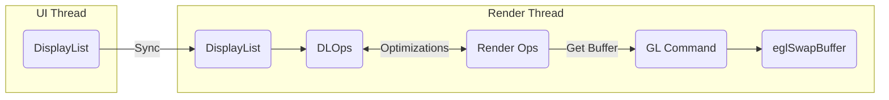

<!--more-->

### ViewRootImpl & View

#### setMeasuredDimension(int measuredWidth, int measuredHeight)

在宽高测量出来后都要将测量结果传递给该方法，需要注意的是，此时 `measureWidth` 和 `measureHeight` 并不一定等于 View 最终的 width 和 height，最终还需要在 layout 阶段才能确定下来。且此时只是将测量结果保存到了 mMeasureWidth 和 mMeasureHeight 上，即 `getMeasureWidth()` 和 `getMeasureHeight()` 方法只是拿到了 View 在 measure 阶段的测量结果，并不一定等于 View 的最终宽高。

## ViewRootImpl

ViewRootImpl实现自ViewParent接口，作为整个控件树的根部，控件的`measure/layout/draw`以及输入事件的派发处理都由ViewRootImpl触发。

### ViewRootImpl的主要成员

- 作为ViewTree的根，把那个管理ViewTree；
- 触发View的measure/layout/draw；
- InputEvent的中转站；
- 管理Surface；
- 负责与WindowManagerService进行通信（Binder IPC）；

### performTraversals()的工作阶段

1. **预测量阶段**：在此阶段中会对控件树进行第一次测量，将会计算出控件树为显示其内容所期望的窗口尺寸。同时View以及子View的`onMeasure()`方法将会沿着控件树依次得到回调；
2. **布局窗口阶段**：根据测量结果，通过`IWindowSession.relayout()`方法向WMS请求调整窗口的尺寸等属性，将引发WMS对窗口进行重新布局，并将布局结果返回给ViewRootImpl；
3. **最终测量阶段**：预测量的结果是控件树所期望的窗口尺寸，然而由于在WMS中影响窗口布局的因素很多，WMS不一定会将窗口准确布局为控件树所要求的尺寸，最终将采用WMS确定的窗口实际尺寸进行最终测量。同时View及其子View的`onMeasure()`方法将会沿着控件树依次被回调；
4. **布局控件树阶段**：完成最终测量之后便可以对控件树进行布局。同时View及其子View的`onLayout()`方法将被回调；
5. **绘制阶段**：这个阶段是performTraversals()的最终阶段，对控件树进行绘制，同时View及其子View的`onDraw()`将被回调；

### MeasureSpec

**SPEC_MODE**

- **MeasureSepc.UNSPECIFIED (0)**：表示控件在进行测量时，可以五十SPEC_SIZE的值。空间可以是它所期望的任意尺寸；
- **MeasureSepc.EXACTLY (1)**：表示子控件必须为SPEC_SIZE所指定的尺寸。当控件的LayoutParams.width/height为确定值，或者是MATCH_PARENT时，对应的MeasureSpec参数会使用这个SPEC_MODE；
- **MeasureSepc.AT_MOST (2)**：表示子控件可以是它所期望的尺寸，但是不得大于SPEC_SIZE。当控件的LayoutParams.width/height为WRAP_CONTENT时，对应的MeasureSepc参数会使用这个SPEC_MODE；

### View的3中测量模式

- EXACTLY
  表示设置了精确的值，一般当 childView 设置其宽、高为精确值、match_paren 时，ViewGroup 会将其设置为 EXACTLY
- AT_MOST
  表示子布局被控制在一个最大值内，一般当 childView 设置其宽、高为 wrap_content 时，ViewGroup 会将其设置为 AT_MOST
- UNSPECIFIED
  表示子布局想要多大就多大，一般出现在 Adapter#Item、ScrollView#childView 的 heightMode 中

## DecorView

DecorView是Window的顶级View，继承自FrameLayout，作为整个ViewTree的根View而存在。

## Canvas API

Canvas API是Android中提供的绘图框架，借助它我们可以创建自定义的形状，如：矩形、圆形等。这些不同形状的绘制是使用Bitmap来完成的。

### 使用Canvas API进行绘制的几个基本组件

通过Canvas API绘制内容需要4个基本组件：

- 一个用于保存像素的Bitmap；
- 一个用于托管绘制调用（写入Bitmap）的画布（Canvas）；
- 一个绘图的基本元素，例如：Rect、Path、Text、Bitmap；
- 一个绘画的画笔（Paint），以描述绘图的颜色和样式；

### Canvas的绘制目标

根据绘制加速模式的不同，Canvas有软件Canvas和硬件Canvas之分。

**软件Canvas**

对于软件Canvas来说，其绘制目标是建立在一个Surface之上的位图Bitmap中的。

**硬件Cnavas**

硬件Canvas的绘制目标有两种：

- HardwareLayout：可以理解为一个纹理（GL Texture），或者更简单的认为是一个硬件加速下的位图Bitmap；
- DisplayList：与Bitmap及HarwareLayout不同的是，DisplayList不是一块Buffer，而是一个指令序列。DisplayList会将Canvas的绘制指令编译并优化为硬件绘制指令，并且可以在需要时将这些指令会放到一个HardwareLayer上，而不需要重新使用Canvas进行绘制；

save()

restore()

invalidate()

### HarwareRender

用于硬件加速的渲染器，负责从Surface生成一个HarwareLayer，供硬件加速图形库作为绘制的目标进行输出，并提供一些列工厂方法用于创建硬件加速绘制过程中所需的DisplayList、HarwareLayer、HarwareCanvas等工具。

### DisplayList

DisplayList的作用是录制来自HarwareCanvas的指令序列。

DisplayList的渲染过程：

1. DisplayList.start()：创建一个HarwareCanvas并准备好开始录制绘图指令；
2. View.draw(canvas)：使用HardwareCanvas进行与Canvas一样的变换与绘制操作；
3. DisplayList.end()：完成录制并回收HardwareCanvas；

