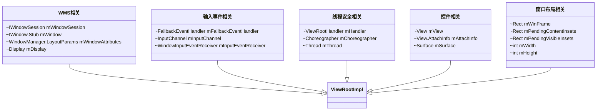

<!--more-->

## View

### View的3中测量模式

- EXACTLY
  表示设置了精确的值，一般当 childView 设置其宽、高为精确值、match_paren 时，ViewGroup 会将其设置为 EXACTLY
- AT_MOST
  表示子布局被控制在一个最大值内，一般当 childView 设置其宽、高为 wrap_content 时，ViewGroup 会将其设置为 AT_MOST
- UNSPECIFIED
  表示子布局想要多大就多大，一般出现在 Adapter#Item、ScrollView#childView 的 heightMode 中

### ViewRootImpl & View

#### setMeasuredDimension(int measuredWidth, int measuredHeight)

在宽高测量出来后都要将测量结果传递给该方法，需要注意的是，此时 `measureWidth` 和 `measureHeight` 并不一定等于 View 最终的 width 和 height，最终还需要在 layout 阶段才能确定下来。且此时只是将测量结果保存到了 mMeasureWidth 和 mMeasureHeight 上，即 `getMeasureWidth()` 和 `getMeasureHeight()` 方法只是拿到了 View 在 measure 阶段的测量结果，并不一定等于 View 的最终宽高。

## ViewRootImpl

ViewRootImpl实现自ViewParent接口，作为整个控件树的根部，控件的`measure/layout/draw`以及输入事件的派发处理都由ViewRootImpl触发。

### ViewRootImpl的主要成员

- 作为ViewTree的根，把那个管理ViewTree；
- 触发View的measure/layout/draw；
- InputEvent的中转站；
- 管理Surface；
- 负责与WindowManagerService进行通信（Binder IPC）；

### performTraversals()的工作阶段

1. **预测量阶段**：
2. **布局窗口阶段**：
3. **最终测量阶段**：
4. **布局控件树阶段**：
5. **绘制阶段**：

## DecorView

Window的顶级View

DecorView是一个FrameLayout，作为Window的顶级View

