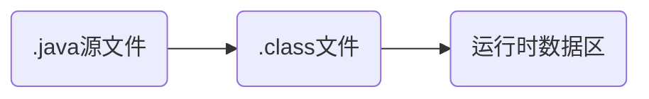

<!--more-->


## Annotation

注解是提供一种为程序元素设置元数据的方法

注解就是定义在类、方法或字段前的元数据，这些元数据可以通过API在编译期间、类加载、运行期间读取，并执行相应的处理。

注解是一种特殊的接口


### 注解的作用

- 作为特定标记
- 编译时动态处理，如动态生成代码
- 运行时动态处理，作为额外信息的载体，如获取注解信息

### 注解的分类

- 元注解
- 标注注解（Java内置注解）
- 自定义注解


## Java内置注解

### @Override

检查方法是否是重写方法。如果发现其父类或者引用的接口中没有该方法时，抛出编译错误。

### @Deprecated

标记过时方法，如果使用该方法，会报编译警告。

### @SuppressWarnings

指示编译器去忽略注解中声明的警告。

### @SafeVarargs

忽略任何使用参数为泛型变量的方法或构造函数调用产生的警告。

### @FunctionalInterface

标识一个匿名函数或函数式接口。


## 元注解

用于定义注解的注解

### @Retention

用于描述注解的生命周期，标识注解在什么范围内有效。

从Java代码到运行的主要周期为：



@Retention则标注了注解的信息要保留到那个阶段，分别对应的值为：


### @Target

用于描述注解作用对象的类型，标识注解可以标注在哪些元素上，并且可以多个取值，value的取值如下：

|       值        |         说明         |
| :-------------: | :------------------: |
|      TYPE       | 类、接口、注解、枚举 |
|      FIELD      |         属性         |
|     METHOD      |         方法         |
|    PARAMTER     |       方法参数       |
|   CONSTRUCTOR   |       构造函数       |
| LOCAL_VARIABLE  |       局部变量       |
| ANNOTATION_TYPE |         注解         |
|     PACKAGE     |          包          |
| TYPE_PARAMETER  |       泛型参数       |
|    TYPE_USE     |       任何元素       |


### @Document

能够将注解中的元素包含到JavaDoc中。

### @Inherited

表示可以被标注类的子类继承，默认下注解没有继承于任何子类。

### @Repeatable

标识注解可以在同一个声明上使用多次。


## 自定义注解


## 注解的属性

注解本身只起到标记作用，如果想给标记的对象传递数据，还需要给注解定义一些属性，这些属性以注解的成员变量在注解中以“无参方法”的形式定义：

```java
@Target(ElementType.FIELD)
@Retention(RetentionPolicy.RUNTIME)
public @interface MyAnnotion {
  String name() default "xxx";
  int age();
}
```

方法名就是该成员变量的名字，返回值就是该成员变量的类型。同时属性还支持默认值。


## 运行时注解

运行时注解就是在运行期间通过反射获取到注解的内容进行处理。


## 编译时注解处理器（Annotation Processing Tool, APT）

编译时注解处理器是javac自带的一个工具，javac会启动一个完整的Java虚拟机来运行注解处理器，用来在编译时扫描和处理注解。

通过继承AbstractProceessor可以自定义处理注解。


注解处理器在处理注解期间如果修改了语法树的话会执重新执行分析以及符号填充的过程，知道处理完所有的注解。


### 编译时注解处理器的特点

优点：

- 对代码进行标记，在编译时收集信息，并做处理。
- 生成一套独立代码，辅助代码运行
- 生成代码位置的可控性（可以在任意包位置生成代码），与原有代码的关联性更为紧密方便
- 更为可靠的自动代码生成
- 自动生成的代码可以最大程度的简单粗暴，在不必考虑编写效率的情况下提高运行效率

缺点：

- APT往往容易被误解可以实现代码插入，然而APT和代码插入是有本质区别的，APT是生成代码；代码插入是修改已有代码
- APT可以自动生成代码，但在运行时却需要主动调用
- APT代码生成于Build目录，只能在运行时通过接口（配合反射）等方式进行操作。这意味着生成的代码必须要有一套固定的模板


### 编译时注解处理器的应用场景

- 某个场景需要写大量重复的代码的时候，可以考虑用APT来进行优化
- 某些用到反射的场景，可以考虑用APT来进行优化
- 例如大量的findViewById、数据库操作代码


### 插件式注解处理器（Pluggable Annotation Processing）

插件式注解处理器，作为APT的替代方案


## 注解的工作流程

1. 通过键值对的形式为注解属性赋值；
2. 编译器检查注解的使用范围（将注解信息写入元素属性表attribute_table）；
3. 运行期间JVM讲单个Class的RUNTIME的所有注解属性去除并最终存入map里；
4. 创建AnnotationInvocationHandler实例并传入前面的map；
5. JVM使用JDK动态代理为注解生成代理类，并初始化处理器；
6. 调用`invoke`方法，通过传入方法名返回注解对应的属性值；


## 注解的应用场景

- Junit4

- 自定义注解和AOP，通过切面实现解耦

  