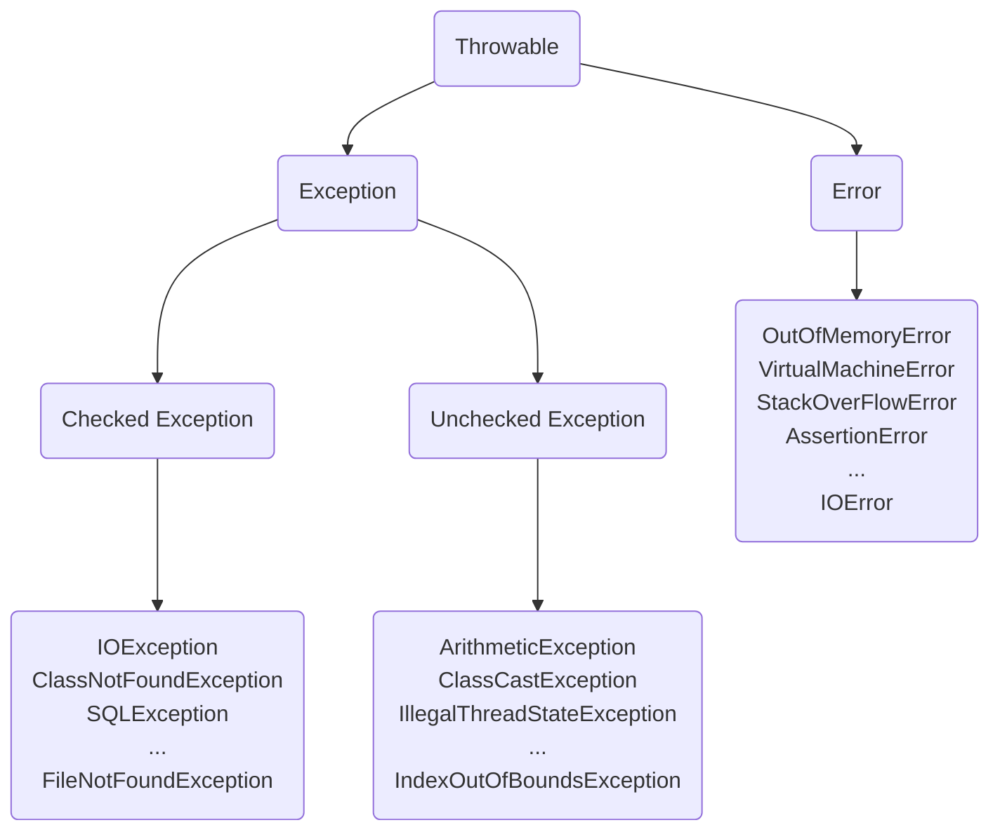

<!--more-->

## Exception Handing

**异常处理**是指在运行时出现例外的情况做出对应的处理，这种情况通常会破坏程序的正常流程。

异常处理的常见的机制是转移控制权，异常抛出（**throw**）后，控制权会被移交至某处捕获（**catch**），并执行处理。

## Java的异常处理

在Java中异常是一个事件（event），它发生在程序运行时并会打乱程序指示的正常流程。当方法出现了错误时，方法会创建一个对象并将它交给运行时系统（runtime system），所创建的对象叫**异常对象**（exception object），该对象描述了出错时的程序类型和状态等错误信息。创建错误对象和转交给运行时系统的过程叫**抛出异常**（throwing an exception）。

## Java异常类层次结构

### Throwable

Throwable是Java中所有错误与异常的超类，Throwable包含了其线程创建时执行堆栈的快照，并提供了`printStackTrace()`等接口用于获取堆栈跟踪数据等信息。

### Error

Error类层次结构描述了Java运行时系统的内部错误和资源耗尽错误。

### Exception

程序本身可以捕获且处理的异常。