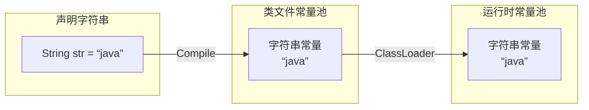

## Java 四大特性

### 抽象

**现实世界的事物被抽象成对象，把具有相同属性和行为的对象抽象成类，再从具有相同属性和行为的类中抽象出父类。**

### 封装

**隐藏具体实现的细节和属性，仅仅对外公开接口。**对于程序合理的封装让外部调用更加方便，更加利于写作。同时，对于实现者来说也更加容易修正和改版代码。

封装具有以下优点：

1. 便于使用者正确、便捷的使用系统，防止使用者错误修改系统属性
2. 提高软件的复用性
3. “高内聚，低耦合”

封装的两大原则：

1. 将不需要对外提供的内容隐藏在内部，仅对外提供便捷使用的接口
2. 把所有的属性都隐藏在内部，对外提供公共方法对其访问

### 继承

**继承是从已有的类中派生出新的类，新的类能吸收已有类的属性和行为，并能扩展新的能力。**比如，我们定义了人类，再定义Boy类时，只需要继承扩展人类即可，实现了代码的重用，不需要重复造轮子（don't reinvent wheels）。

Java中继承的特点：

- 被继承的类叫父类（parent class）或超类（superclass），继承父类的类叫子类（subclass）或派生类（derivedclass）。
- 子类继承父类的属性和方法，但父类私有属性和构造方法除外
- 子类出了拥有从父类继承过来的属性和方法外，还可以拥有属于自己的属性和方法
- 在Java中只支持单一继承，也就是说一个子类只能有一个父类，但一个父类可以有多个子类

### 多态

多态是指在基类或接口中定义的属性或方法被子类继承后，可以具有不同的数据类型或表现形式。

Java多态的特点：

- 多态是运用数据抽象和继承特性进行协同工作的；
- Java中除了`static`方法和`final`方法（`private`方法也属于`final`方法）之外，其他的方法都是动态绑定的（多态的特性）；

#### 动态绑定

首先，**把一个方法与其所在的类或对象关联起来叫作方法的绑定**，绑定分为静态绑定（前期绑定）和动态绑定（后期绑定）。程序在JVM运行过程中，会把雷的信息、static属性和方法、final常量等云数据加载到方法区，这些信息在类加载时就已经知道，不需要创建对象就能访问，就是静态绑定的内容；需要等对象创建出来，调用时根据对重的实例对象的类型才进行访问就是动态绑定的内容。

静态绑定是指在程序运行前就已经知道方法是属于哪个类的，在编译的时候就可以连接到类中，并定位到整个该方法。

**动态绑定是指运行期间根据所引用对象的实际类型调用相应的方法**，即根据具体的实例对象才能具体确定是哪个方法。

动态绑定是多态性得以实现的重要因素，通过方法表中对每个类定义的方法的签名和指针，即指向一个具体的方法代码。当某个类重写了基类中的某个方法，在该方法发生调用时，JVM会把该类的实例对象压入操作数栈中进行调用，则调用的是该类对应的表项，即向重写方法的代码实现处。

#### 特设多态

特设多态为个体的特定类型的任意集合定义个共同接口。

#### 参数多态

指定一个或多个类型补考名字而是靠可以表示任何类型的抽象符号。

#### 子类型多态

一个名字指称很多不同的类的实例，这些类有某个共同的基类。


## Java 关键字

### static 关键字

1. 静态初始化只在必要时才会进行，即归属的Class对象首次加载的时候进行一次；
2. 静态对象优先于非静态对象进行初始化；
3. 构造器实际上也是静态方法；


## 内部类（Inner Class）

1. 内部类自动拥有对其外部类所有成员的访问权；
2. 非静态内部类对象隐式地保存了一个外部类的引用；
3. 内部类是一个编译器现象，与虚拟机无关，编译器会将内部类转换为常规的类文件，用`$`符号分隔外部类名与内部类名；

### 匿名内部类（Anonymous Class）

1. ~~匿名内部类中使用外部类的参数必须是`final`的；~~
1. 由于构造器的名字必须与类名相同，而匿名内部类没有类名，所以内部类不能有构造器；
1. 匿名内部类一般用于继承其他类或实现接口，并不需要额外添加方法，只是对继承方法的实现或重写；
1. 匿名内部类不能修改外部局部变量，因为匿名内部类的变量传递是基于构造器传参的，内部修改外部局部变量的副本，对外部类不会产生效果；

### 嵌套类（静态内部类）

1. 不能与外部类对象之间有联系；
2. 不能从嵌套类的对象中访问非静态的外部类对象；

### 闭包与回调

闭包（closure）是一个可调用的对象，内部类就是面向对象的闭包，因为它不仅包含外部类对象的信息，还自动引诱了一个指向外部类对象的引用，在此作用域内，内部类有权操作所有的成员，包括`private`。

### 局部内部类（Local Class）

在方法体内创建的内部类即局部内部类，不能有访问说明符，它不属于外部类的一部分，但可以访问当前代码块内的常量，以及外部类的私有成员。


## 包装类（Boxing）

Java中的基本类型都有着相对应的包装类，基本类型和包装类型可以通过赋值“语法糖”互相赋值

### 字面量

**字面量（literal）是用于表达源代码中一个固定值的表示法（notation）**。譬如：5、1000L等值分别是整型和长整型的字面量。
Java编译器在编译时会检查字面量所表示的数字大小是否处于变量类型的合法范围内，不符合则无法通过编译，如果多种数值类型进行数学运算，计算结果的类型是其中这些数值中等级最高或更高的类型。

### 包装类缓存

在包装类中，缓存的基本数据类型值得范围如下：

| 包装类型  | 基本数据类型 | 缓存对象（基本数据类型值） |
| :-------: | :----------: | :------------------------: |
|  Boolean  |   boolean    |    true,false（全部值）    |
|   Byte    |     byte     |     -128~127（全部值）     |
|   Short   |    short     |          -128~127          |
| Character |     char     |           0~127            |
|  Integer  |     sint     |   -128~127（默认为127）    |
|   Long    |     long     |          -128~127          |
|   Float   |    float     |          无缓存值          |
|  Double   |    double    |          无缓存值          |

### 自动装箱、拆箱

基本类型与包装类型进行运算或赋值时，Java在编译期间将对他们进行互相转换，基本数据类型转换成对应的包装类型对象，这个过程叫做自动装箱，反之叫做拆箱。


## 字符串（String）

String是Java中比较特殊的一种基本类型，它的字面量由一个`final char`类型的数组维护的。

String是值不可变（immutable）的常量，是线程安全的（can be shared）。

### 不可变性


### 操作符重载

一个操作符在应用于特定类时，被赋予特殊的意义。譬如：用于String的 “`+`” 和 “`+=`”是Java中仅有的两个重载过得操作符。

在进行String字符串拼接时，编译器会进行优化，把“`+`” 和 “`+=`”操作符替换成`StringBuilder`，通过`append`操作进行拼接。

### char类型


### String常量池

1. `String s = "xxx";`
   使用字面量形式声明对象时，会检查字符串常量池中是否已经存在该对象，如果存在直接将引用指向已存在的对象，如果不存在，将该对象放入常量池；
2. `String s = new String("xxx");`
   使用`new`关键字声明对象时，会先检查字符串常量池中是否已经存在该对象，如果存在直接将引用指向该对象，否则将该对象放入常量池 ，此外还会开辟一块内存地址，并将该引用指向常量池中字面量的地址；

### 字符串的生命周期



### String中的设计模式

#### 享元模式

共享元素模式，一个系统重如果有多处用到相同的元素，那么应该只存储一份该元素，让所有使用的地方都引用这个元素。


### String.intern()

`String.intern()`可以保证相同内容的字符串变量引用统一的内存对象。


## 泛型

### 通配符

通配符可用于代替单个或多个字符，通常地，`*`匹配0个或以上的字符，`?`匹配1个字符。


## 操作符

### 位运算符

位运算符作用在所有的位上，并且按位运算，假设`a=60`, `b=13`,他们的二进制格式表示如下：

```
A = 0011 1100
B = 0000 1101
--------------
A&B = 0000 1100
A|B = 0011 1101
A^B = 
```

| 运算符 | 含义                    | 描述                                     | 实例                  |
| :----: | ----------------------- | ---------------------------------------- | --------------------- |
|   &    | 按位进行与运算（AND）   | 如果相对应的位都是1，则结果为1，否则为0  | A&B = 12 (0000 1100)  |
|   \|   | 按位进行或运算（OR）    | 如果相对应的位都是0，则结果为0，否则为1  | A\|B = 61 (0011 1101) |
|   ^    | 按位进行异或运算（XOR） | 如果相对应的位值相同，则结果为0，否则为1 | A^B = 49 (0011 0001)  |
|   ~    | 按位进行取反运算（NOT） | 翻转操作数的每一位，即0变成1,1变成0      | ~A = -61 (1111 0000)  |

### 位移运算符

| 运算符 | 含义             | 描述                                            | 实例                   |
| :----: | ---------------- | ----------------------------------------------- | ---------------------- |
|   >>   | 右移位运算符     | 操作数按位向右移动，低位移出（舍弃），高位补0   | A>>2 = 15 (0000 1111)  |
|   <<   | 左移运算符       | 操作数位按位向右移动，高位移出（舍弃），低位补0 | A<<2 = 240 (1111 0000) |
|  >>>   | 无符号右移运算符 |                                                 |                        |

### 复合位赋值运算符

