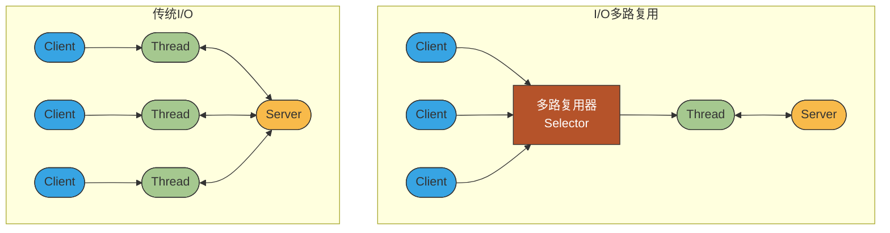

<!--more-->

## 基础概念

### File desriptor (FD)

**文件描述符**是一个用于描述指向文件的引用的抽象概念。内核为每个进程独立维护了打开文件的记录表，文件描述符正式指向记录表里的某个记录。当程序打开或创建一个文件时，内核会向进程返回一个文件描述符。

## Blocking I/O (BIO)

**阻塞式I/O模型**，应用进程从recvfrom进入系统调用直到数据准备就绪并被复制到应用进程的缓冲区或发生错误才返回，这个过程用户进程是被阻塞的。

在Java BIO中，accept和read方法都是阻塞操作，当没有连接请求，accept方法阻塞，当无数据可读取，read方法阻塞。

## Non-Blocking I/O (NIO)

**非阻塞式I/O模型**，应用进程从recvfrom进入系统调用，当内核接收这类I/O请求时不会把应用进程投入睡眠状态，而是返回一个错误，通常应用进程会对这样一个非阻塞描述符进行循环调用，直到数据准备就绪并从内核空间复制到应用进程的缓冲区并返回结果，才结束轮询。

需要注意的是，数据结果从内核空间复制到用户空间的过程是阻塞的，但通常对于操作系统来说这个过程的速度是非常快的，可以忽略不计。

服务端一个线程可以处理多个请求，客户端发送的连接请求注册在多路复用器Selector中，服务端线程通过轮询多路复用器查看是否有IO请求，有则进行处理。

## I/O Multiplexing

**I/O多路复用模型**指多路IO的Channel或Socket可以共用一个或者少量的线程。它的出现是为了解决传统IO模型中一个客户端对应一个处理线程，在高并发情况下的性能问题。

在Java中，通常客户端发送的连接请求注册在多路复用器Selector中，Selector内部的机制可以自动不断地查询（Select）这些注册的Channel是否有已就绪的I/O事件，这样程序就可以使用单个线程管理多个Channel。

Linux中I/O多路复用模型的API有`select/poll/epoll`。

两次系统调用

**I/O多路复用**是一种同步的IO模型，可以实现一个线程监控多个文件句柄。一旦某个文件句柄就绪，就能通知到对应应用程序进行相应的读写操作；没有文件句柄就绪时就会阻塞应用程序，从而释放CPU资源。

## Aysnchronous I/O Model (AIO)

**异步非阻塞模型**，主要的机制是：告知内核启动某个操作，并让内核在整个操作（包括将数据从内核空间负责到用户空间）完成后通知用户。

AIO一般用于连接数较多且连接时间较长的应用，在读写事件完成后由回调服务通知启动线程进行处理。与NIO不同，当进行读写操作时，只需直接调用`read/write`方法即可。这两种方法均是异步的，即完成操作后主动调用回调函数：

- **read()**：当有流可读取时，操作系统会将可读的流传入`read()`方法的缓冲区，并通知应用程序；
- **write()**：当操作系统将`write()`传递的流写入完毕时，主动通知应用程序；

## Signal-Driven I/O Model

信号驱动I/OM模型，通过信号让内核在文件描述符就绪时发送SIGIO信号通知用户。

## Comparison of the I/O Models

I/O模型对比：

可见前4种模型的区别在等待数据的阶段，数据就绪从内核空间拷贝到用户空间的缓冲区期间，真正的I/O操作（recvfrom）将阻塞进程，这个阶段它们都是是一样的。相反，异步I/O不会导致请求进程阻塞。

I/O模型划分：

## select

select是典型的**同步阻塞I/O复用模型**，该函数允许进程指示内核等待多个事件中的任何一个事件发生，并只在有一个或多个事件发生或经理一段指定的时间后才唤醒它。

## poll

## epoll

**epoll**是Linux内核中I/O多路复用技术的一种实现，设计的目的是取代既有POSIX的`select`/`poll`函数，它能让需要大量操作文件描述符的程序得以发挥更优异的性能。另一点就是在获取事件时，它无须遍历整个被侦听的描述符集，只要遍历那些被内核IO事件异步唤醒而加入Ready队列的描述符集就行。

epoll机制中当一种文件描述符的内核缓冲区非空时，发出可读信号进行通知，当缓冲区不满时，发出可写信号通知。

**epoll的三大关键要素**

- **mmap**
  mmap将用户空间和内核空间的一块内存地址同时映射到相同的一块物理内存地址上，使得这块物理内存对内核和用户均可见，减少用户态和内核态之间额数据交换；
- **红黑树**
  epoll通过红黑树存储所监听的套接字，红黑树本身插入删除性能较好；
- **链表**
  在`ep_poll_callback`回调函数中，把添加进来的事件放到`rdllist`这个双向链表中；

## select vs poll vs epoll

| 系统调用           | select                     | poll                       | epoll                                                        |
| ------------------ | -------------------------- | -------------------------- | ------------------------------------------------------------ |
| 数据结构           | 数组（bitmap）             | 链表                       | 链表+红黑树                                                  |
| 最大连接数         | 1024                       | -                          | -                                                            |
| fd数据拷贝         | 每次调用select拷贝         | 每次调用poll拷贝           | 首次调用epoll_ctl建立内存映射(mmap)，每次调用epoll_wait不需要频繁拷贝 |
| 时间复杂度         | O(n)                       | O(n)                       | O(1)                                                         |
| 内核实现和工作效率 | 采用轮询方式来检查就绪事件 | 采用轮询方式来检查就绪事件 | 采用回调方式检查就绪事件                                     |
| 性能               | 随着连接数增加，性能下降   | 随着连接数增加，性能下降   | 随着连接数增加，性能基本上没有下降                           |

## 触发模式

epoll提供边缘触发和状态触发模式。

### 边缘触发

### 状态触发

