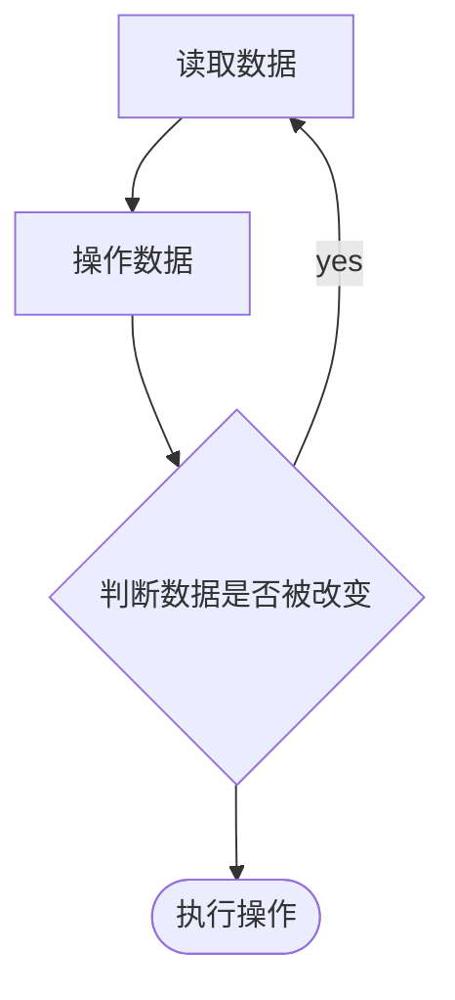

在面向过程的C语言中，数据结构是用`struct`来描述，而在面向对象的编程中，数据结构是用类来描述的，并且包含有对该数据结构操作的方法。
在Java语言中，Java语言的设计者对常用的数据结构和算法做了一些规范（接口）和实现（具体实现接口的类）。**所有抽象出来的数据结构和操作（算法）统称为Java集合框架（Java Collection Framework）**。

<!--more-->

## Collection


<br>

## List

有序，线性结构，可有重复元素。

<br>

### ArrayList

#### 动态扩容

`System.arraycopy`为JVM内部固有方法，它通过手工编写汇编或其他优化方法来进行Java数组拷贝，这种方式比起直接在Java上进行`for`循环或`clone`是更加高效的，数组越大体现地越明显。

#### 序列化

Arraylist的数据存储变量被修饰为`transient`，理论上不能序列化的，但通过特殊的序列化方式来实现，`elementData`更像是ArrayList的缓冲区，空间往往比实际使用大，使用这种方式序列化避免空间浪费。
```java
private void writeObject(java.io.ObjectOutputStream s)
        throws java.io.IOException{
        // Write out element count, and any hidden stuff
        int expectedModCount = modCount;
        s.defaultWriteObject();

        // Write out size as capacity for behavioural compatibility with clone()
        s.writeInt(size);

        // Write out all elements in the proper order.
        for (int i=0; i<size; i++) {
            s.writeObject(elementData[i]);
        }

        if (modCount != expectedModCount) {
            throw new ConcurrentModificationException();
        }
    }
```

<br>

### LinkedList

LinkedList基于链表，不需要提前申请内存大小

<br>

## Set

无序，不允许重复。

<br>

### HashSet

HashSet在HashMap的基础上包装了一层，

### LinkedHashSet

### TreeSet


## Map

具有映射关系的集合，元素以键值对（key-value）的形式存储。


<br>

### HashMap

JDK 1.7中数组是HashMap的主体，链表则是主要为了解决哈希冲突而存在的。

JDK 1.8 中由数组+链表+红黑树组成。

<br>

### HashTable

#### fast-fail

fast-fail指的是在使用迭代器遍历集合过程中，如果集合发生了结构性改变，如添加数据、扩容、删除数据等，迭代器会抛出异常。Hashtable的fast-fail继承于Iteractor接口。

### ConcurrentHashMap

#### JDK1.7


#### JDK1.8


#### CAS

CAS是乐观锁的一种实现方式，是一种轻量级锁，线程在读取数据时不进行加锁，在准备写回数据时，比较原值是否修改，若未被修改则写回，已修改则重新执行读取流程。



<br>

### LinkedHashMap

LinkedHashMap继承自HashMap，区别在于Linked维护了一个运行于所有条目的双重链表，此链表定义了键的插入顺序，确保在映射中重新插入键不会影响顺序。


<br><br>
