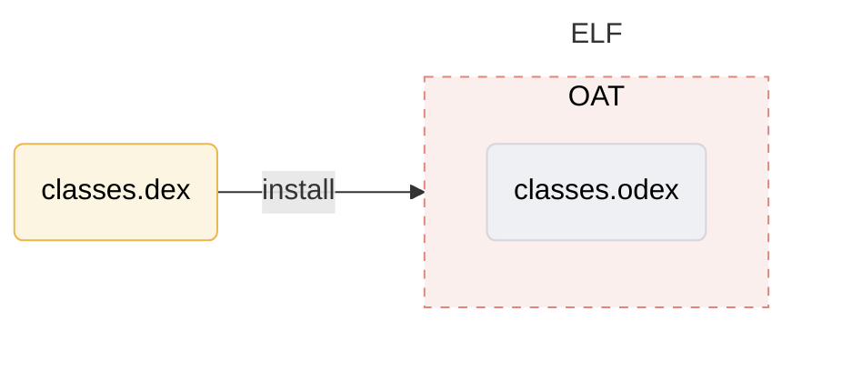

深入理解Android虚拟机——ART

**ART(Android Runtime)**是Android上的应用和部分系统服务使用的托管式运行时。

<!--more-->

## 1. 深入理解Dex文件格式

**Dex（Dalvik Executable format）是Android平台上传统Class文件对应的Java字节码文件**。Dex文件的核心内容其实与传统Class文件类似，只不过针对移动设备做了一些定制化处理。在一些工具的帮助下，Dex文件和Class文件可以互相转换。

引言：*为什么Android平台不直接使用Class文件，而是另起炉灶重新实现一种新的文件格式呢？*

Android系统主要用于移动设备，而移动设备的内存、存储空间相对PC平台而言较小，并且主要使用ARM的CPU；ARM的CPU有一个显著特点，就是通用寄存器比较多，在这种情况下，Class格式的文件在移动设备上不能扬长避短。

我们知道Class文件中指令码执行的时候需要存取*操作数栈（Operand Stack）*，而在ARM平台下可以利用寄存器来存取参数，显然寄存器的存取速度比位于内存中的操作数栈要快得多，所以Dex就诞生。


### Dex和Class文件格式的区别

#### 字节码文件

一个Class文件对应一个Java源码文件，而一个Dex文件可对应多个Java源码文件，但从编译过程来看，Java源码文件其实会先编译成多个`.class`文件，然后再由工具合并到`classes.dex`文件中，这么做有以下两个优点：

1. 虽然Class文件通过索引方式能减少字符串等信息的冗余度，但是多个Class文件之间可能还是有重复字符串等信息；而`classes.dex`由于包含了多个Class文件的内容，所以可以进一步去除其中的重复信息；
2. 如果一个Class文件依赖另外一个Class文件，则虚拟机在处理的时候需要读取另外一个Class文件的内容，这可能会导致CPU和存储设备进行更多的I/O操作。而`classes.dex`由于一个文件就包含了所有的信息，相对而言会减少I/O操作的次数；

#### 字节序

Java平台上采用的是**Big Endian**字节序来组织字节码内容，而Android平台默认的字节序是**Little Endian**。


### Dex文件格式

| 名称           | 格式                 | 说明                                                         |
| :------------- | :------------------- | :----------------------------------------------------------- |
| header         | header_item          | 标头                                                         |
| string_ids     | string_id_item[]     | 字符串标识符列表。这些是此文件使用的所有字符串的标识符，用于内部命名（例如类型描述符）或用作代码引用的常量对象。此列表必须使用 UTF-16 代码点值按字符串内容进行排序（不采用语言区域敏感方式），且不得包含任何重复条目。 |
| type_ids       | type_id_item[]       | 类型标识符列表。这些是此文件引用的所有类型（类、数组或原始类型）的标识符（无论文件中是否已定义）。此列表必须按 `string_id` 索引进行排序，且不得包含任何重复条目。 |
| proto_ids      | proto_id_item[]      | 方法原型标识符列表。这些是此文件引用的所有原型的标识符。此列表必须按返回类型（按 `type_id` 索引排序）主要顺序进行排序，然后按参数列表（按 `type_id` 索引排序的各个参数，采用字典排序方法）进行排序。该列表不得包含任何重复条目。 |
| field_ids      | field_id_item[]      | 字段标识符列表。这些是此文件引用的所有字段的标识符（无论文件中是否已定义）。此列表必须进行排序，其中定义类型（按 `type_id` 索引排序）是主要顺序，字段名称（按 `string_id` 索引排序）是中间顺序，而类型（按 `type_id` 索引排序）是次要顺序。该列表不得包含任何重复条目。 |
| method_ids     | method_id_item[]     | 方法标识符列表。这些是此文件引用的所有方法的标识符（无论文件中是否已定义）。此列表必须进行排序，其中定义类型（按 `type_id` 索引排序）是主要顺序，方法名称（按 `string_id` 索引排序）是中间顺序，而方法原型（按 `proto_id` 索引排序）是次要顺序。该列表不得包含任何重复条目。 |
| class_defs     | class_def_item[]     | 类定义列表。这些类必须进行排序，以便所指定类的超类和已实现的接口比引用类更早出现在该列表中。此外，对于在该列表中多次出现的同名类，其定义是无效的。 |
| call_site_ids  | call_site_id_item[]  | 调用站点标识符列表。这些是此文件引用的所有调用站点的标识符（无论文件中是否已定义）。此列表必须按 `call_site_off` 以升序进行排序。 |
| method_handles | method_handle_item[] | 方法句柄列表。此文件引用的所有方法句柄的列表（无论文件中是否已定义）。此列表未进行排序，而且可能包含将在逻辑上对应于不同方法句柄实例的重复项。 |
| data           | ubyte[]              | 数据区，包含上面所列表格的所有支持数据。不同的项有不同的对齐要求；如有必要，则在每个项之前插入填充字节，以实现所需的对齐效果。 |
| link_data      | ubyte[]              | 静态链接文件中使用的数据。本文档尚未指定本区段中数据的格式。此区段在未链接文件中为空，而运行时实现可能会在适当的情况下使用这些数据。 |


### Dex指令码

Dex指令码的条数和Class指令码差不多，但Dex文件中存储函数内容的`insns`数组（位于`code_item`里）比Class中的`code`数组（位于`Code`属性中）解析难度要大，原因是ART在执行指令不需要操作数栈。


## 2. 深入理解ELF文件格式

### 概述

`.oat`文件是ART虚拟机上的“可执行文件”，是Android定制的一种ELF文件格式，通过`classes.dex`转换而来。



下面演示Android平台中从Java源码到OAT的转换过程：


### ELF文件格式

**ELF（Executable and Linkable Format）**是一种可执行文件，目标文件，共享链接库和内核转储（core dumps）准备的标准文件格式，同时是Unix/Linux平台上最通用的二进制文件格式。

- **Excutable（可执行文件）**指ELF文件将参与程序执行工作，包括二进制程序的运行以及动态库 `.so` 文件的加载；
- **Linkable（可链接的）**指ELF文件是编译连接工作的重要参与者；


ELF文件由以下三部分组成：

1. **ELF头（ELF header）**描述文件的主要特性：类型、CPU架构、入口地址，现有部分的大小和偏移量等等；
2. **程序头表（Program header table）**列举了所有有效的段（segments）和他们的属性；
3. **节头表（Section header table）**包含对节（sections）的描述；


#### ELF头（ELF header）结构

**ELF头（ELF header）**主要的目的是定位文件的其他部分，文件头主要包含以下字段：

```c
typedef struct elf64_hdr {
    unsigned char e_ident[EI_NIDENT];//ELF文件鉴定，用来确认文件是否是ELF文件，并且提供普通问就能特征信息
    Elf64_Half e_type;	//文件类型，描述文件是一个什么乐行：重定位文件、可执行文件...
    Elf64_Half e_machine;
    Elf64_Word e_version;	//ELF文件格式的版本
    Elf64_Addr e_entry;	//程序入口地址
    Elf64_Off e_phoff;	//程序头标的文件偏移量
    Elf64_Off e_shoff;	//节头表的文件偏移量
    Elf64_Word e_flags;
    Elf64_Half e_ehsize;
    Elf64_Half e_phentsize;
    Elf64_Half e_phnum;
    Elf64_Half e_shentsize;
    Elf64_Half e_shnum;
    Elf64_Half e_shstrndx;
} Elf64_Ehdr;
```

#### 节（sections）结构

所有的数据都存储在ELF文件的节（sections）中，通过节头标的索引（index）来确认接（sections）；节头标表项包含以下字段：

```c
typedef struct elf64_shdr {
    Elf64_Word sh_name;	//节的名称
    Elf64_Word sh_type;	//节的类型
    Elf64_Xword sh_flags;	//节的属性
    Elf64_Addr sh_addr;	//内存地址
    Elf64_Off sh_offset;	//文件中的偏移量
    Elf64_Xword sh_size;	//节的大小
    Elf64_Word sh_link;	//到其它节的链接
    Elf64_Word sh_info;	//各种各样的信息
    Elf64_Xword sh_addralign;	//地址对齐
    Elf64_Xword sh_entsize;	//表项的大小，如果有的话
} Elf64_Shdr;
```

#### 程序头表（Program header table）结构

在可执行文件或者共享链接库中所有的节都被分为多个端（segments），程序头是一个结构的数组，每个结构都表示一个段（segments）：

```c
typedef struct elf64_phdr {
    Elf64_Word p_type;
    Elf64_Word p_flags;
    Elf64_Off p_offset;
    Elf64_Addr p_vaddr;
    Elf64_Addr p_paddr;
    Elf64_Xword p_filesz;
    Elf64_Xword p_memsz;
    Elf64_Xword p_align;
} Elf64_Phdr;
```


## 3. 认识C++11

引言：*当Google用ART虚拟机替代Dalvik的时候，连ART虚拟机的实现代码都切换到了C++11。*


## 4. 编译dex字节码为机器码

Android在Dalvik时代采用的是JVM中**JIT即时编译**方案，在ART时代开始转而采用了**AOT预编译**方案，AOT方案在安装应用程序时就会尝试将APK中大部分Java函数的字节码转换为机器码，来尽可能提升虚拟机运行速度，但是带来的副作用就是APK安装时间变长了，因为编译生成OAT文件过大等会产生一些列较为影响用户体验的副作用；为此，在Android 7.0中Google对ART进行了改造，综合使用了JIT、AOT编译方案，解决了之前存AOT的弊端。

### 4.1 主流三段式编译器架构

- **前端（Frontend）**的工作集中在**词法分析**、**语法分析**、**语义分析**以及**中间表示生成**这几个主要部分；
- **优化器**是ART编译器中最重要的一部分，优化器的输入是未优化的IR，输出是优化后的IR。常用的优化手段有循环优化、常量传播和折叠、无用代码消除、方法内联优化等。另外，优化器在优化阶段的最后还要执行一项非常重要的工作，即考虑如何分配物理寄存器；
- **后端（Backend）**的工作主要是**机器码生成**


### 4.2 寄存器分配

经过优化器的IR优化后，下一步就要考虑寄存器的分配（Register Allocation）和指派（Register Assignment）问题了，而寄存器分配属于优化工作的一部分，它往往在优化的最后阶段来执行。

dex指令码操作的是虚拟寄存器，而虚拟寄存器没有个数限制，但物理上的寄存器是有个数限制的，所以寄存器分配解决的是IR里使用的虚拟寄存器和物理寄存器的有限个数之间的矛盾。


## 5. 虚拟机的创建和启动

在Android中所有Java进程都由Zygote进程`fork`而来，而Zygote进程自己又是Linux系统上的`init进程`，通过解析配置脚本来启动的。

- **Runtime对象**即ART虚拟机在Native层代码中的描述，整个虚拟机包含很多模块，这些模块对应的对象都可以通过Runtime相关接口获取；
- **Thread类**代表虚拟机内部执行线程，它和线程堆栈的位置、代码的执行等息息相关；
- **Heap类**封装了加载到虚拟机进程里的各种内存映射对象，包括加载镜像文件的`ImageSpace`、用于内存分配的`MallocSpace，还包含GC相关的多个功能；
- **ClassLinker**用于管理虚拟机所加载的各种Class信息；
- **JavaVmExt**是JavaVm的派生类，是ART虚拟机JNI层中Java虚拟机的化身；
- 一些其他的辅助类，比如**MemMap**、**OatFileManger**、**Space家族**、**HeapBitmap**、**GcRoot**等；

### 5.1 初识JNI

**JNI（Java Native Interface）**即Java本地接口，提供了两个关键数据结构**JavaVM**和**JNIEnv**以及一组API，使得Java虚拟机中的Java程序可以调用Native实现的函数。


