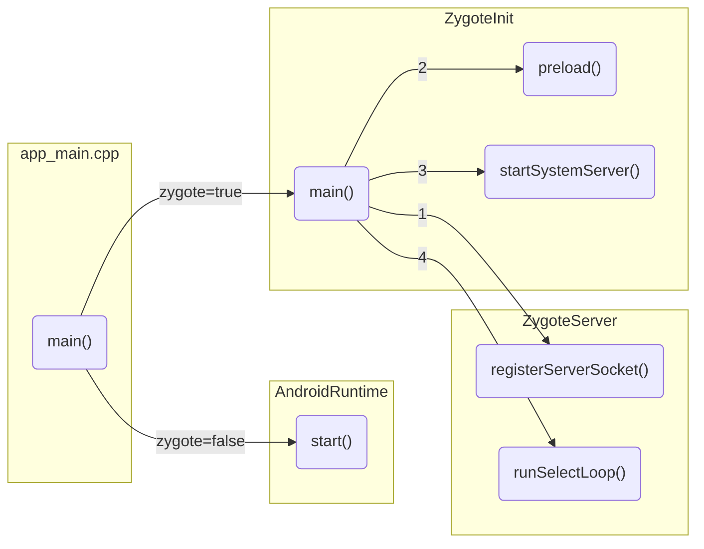
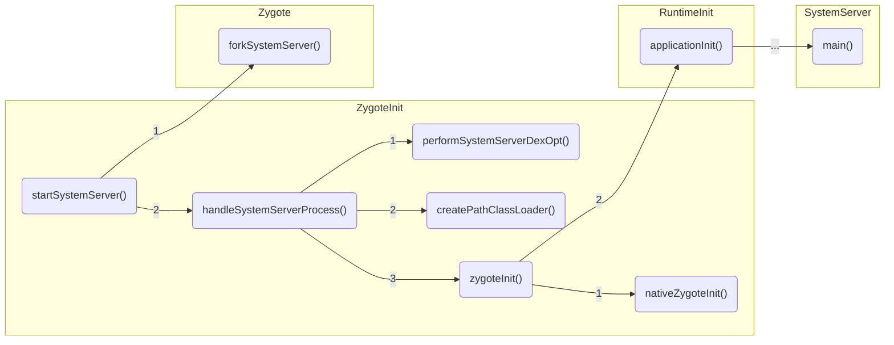
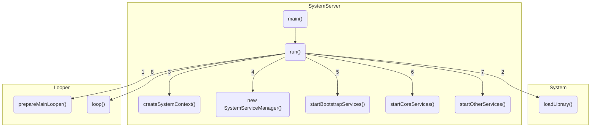
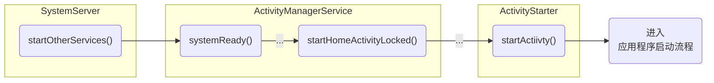
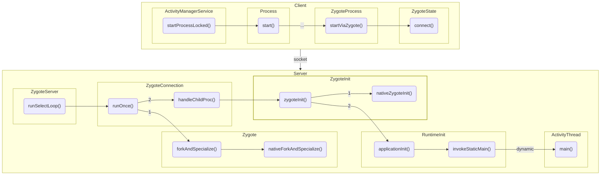
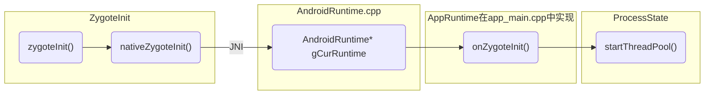
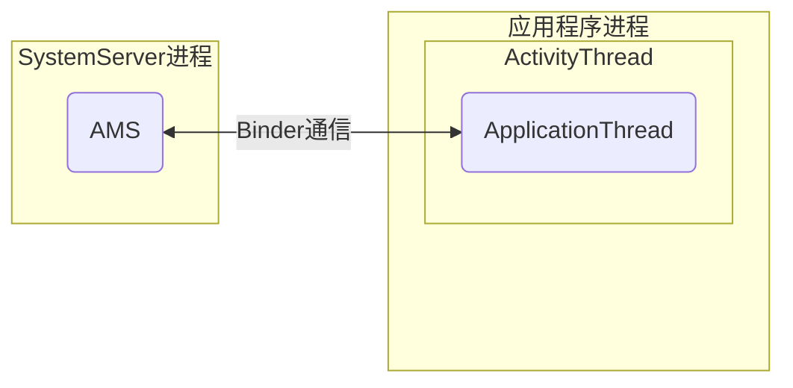

本文将介绍Android从操作系统到应用程序再到Activity的启动过程，加深了解Android系统架构每个层级所处理的一些事情。

<!--more-->


## Android操作系统的启动流程

### 1. 内核的启动过程

Android内核的启动过程，首先从硬件层按下Power开机键开始，加载并启动引导程序，启动内核层的第一个内核空间的`kthreadd`进程，然后再启动Native框架层的第一个用户空间的`init`进程，这就是Android内核的整个启动过程。


1. **Boot ROM**：引导芯片从固化在ROM里的预设代码开始执行，然后加载引导程序Bootloader到RAM中，然后执行；
2. **Bootloader**：整个操作系统的启动任务由Bootloader引导加载程序来完成，Bootloader将初始化硬件设备、建立内存映射图，为最终调用操作系统内核前准备好正确的软硬件环境；
3. **Linux Kernel**：当内核启动了自己后（装入ARM并开始执行），启动`swapper`进程（pid=0，又称idle进程），`swapper`是内核从无到有开创的第一个进程，主要用于初始化和处理以下几件事情：
   - 启动`kthreadd`进程（pid=2），`kthreadd`是Linux所有内核进程的第一个进程，主要用于进程管理，并且创建内核的工作线程`kworkder`、软中断线程`ksoftirqd`，`termal`等内核守护进程；
   - 设置缓存和受保护的存储器；
   - 加载Display Driver、Camera Driver、Binder Driver等驱动程序；
   - 加载`init`程序，从系统文件中查找`init.rc`脚本文件并执行；

接下来将进入`init`进程的启动过程。

### 2. init进程的启动过程

首先，Linux下所有进程都由`init`进程或其子进程产生，`init`同时也是用户空间的第一个进程（pid=1，又称根进程）。`init`进程由多个源文件共同组成，因为Linux世界中一切皆为文件，即任何东西都以文件的形式来呈现，好处是大部分操作可用统一接口，甚至只用`open/read/write/ioctl/close`即可完成大部分操作。

从`init.cpp`的`main()`方法进入`init`进程，它主要的职责有：
1. **挂载运行时目录**，如`/sys`、`/dev`、`/proc`等，运行时目录只在系统运行时存在，系统停止同时消失；
2. **启动属性服务（property service）**，类似于Windows的注册表管理器，用于记录用户和软件的一些使用信息，即时系统或者软件重启，还能根据属性服务中的记录进行相应的初始化工作；
3. **解析`init.rc`文件**，该脚本文件将启动Native的守护进程，如ServiceManager、MediaServer等；
4. **处理孤立进程**，通过`signal`方式处理孤立进程（子进程）的终止；

`init.rc`脚本文件的解析是非常重要的步骤，当解析到`zygote-start`语句时，将根据处理器类型（32/64位）执行相应的`init.zygoteXX.rc`文件，此时将解析启动Zygote进程的关键语句：

```
//通知init创建名为zygote的进程，路径为/system/bin/app_process64，后面的是传给app_process64的参数
service zygote /system/bin/app_process64 -Xzygote /system/bin --zygote --start-system-server
    class main	//指zygote进程的classname
    priority -20
    user root
    group root readproc
    socket zygote stream 660 root system	//创建socket
    onrestart write /sys/android_power/request_state wake
    onrestart write /sys/power/state on
    onrestart restart audioserver	//当zygote重启时，重启audio服务
    onrestart restart cameraserver  //当zygote重启时，重启camera服务
    onrestart restart media  //当zygote重启时，重启media
    onrestart restart netd  //当zygote重启时，重启netd
    onrestart restart wificond  //当zygote重启时，重启wificond
    writepid /dev/cpuset/foreground/tasks
```

> 具体启动Zygote服务的过程这里就不展示了，可以参考「Android进阶解密」的解析。

最终进入`app_main.cpp`的`main()`方法，在执行以下语句后将启动Zygote进程，同时也将进入Java的世界。

```cpp
runtime.start("com.android.internal.os.ZygoteInit", args, zygote);
```

### 3. Zygote进程启动过程

Zygote进程又称孵化器，是一个特殊的Android系统进程的，首先Zygote将应用程序在运行时可能需要的所有类和资源预加载到系统内存中来实现高效和快速的应用启动，然后通过Socket连接来监听应用程序的启动请求，当收到请求时通过`fork`形式来创建应用程序，`fork`功能来自Linux内核的写时复制（Copy-on-Write）的资源管理技术实现。

> **写时复制（Copy-on-Write）**的核心思想是，如果有多个调用者（callers）同时请求相同资源，他们会共同获取相同的指针指向相同的资源，直到调用者视图修改资源内容时，系统才会讲真正复制一份专用副本（private copy）给调用者，而且他调用者所见到的最初资源仍然保持不变，这个过程对其他调用者是透明的。优点是如果调用者没有修改该资源，就不会有副本被创建，因此多个调用者只是进行读取操作时可以共享同一份资源。

Zygote除了用于`fork`应用程序进程，还显示启动了`system_server`进程，同时还负责创建Dalvik/ART虚拟机。

前面`init`进程启动Zygote进程后，进入了`app_main.cpp`的`main()`方法，然后分别两个执行分支：

- 当zygote为`true`时，执行`ZygoteInit.main()`方法；
- 对那个zygote为`false`时，执行`RuntimeInit.main()`方法；

接着就开始了Zygote的启动过程，主要由以下几个步骤：


1. **AndroidRuntime.start()**：创建Dalvik/ART虚拟机，并注册JNI方法为后面与Native的互调做好准备；
2. **ZygoteInit.main()**：通过JNI调用ZygoteInit类，首次进入Java的世界；
3. **ZygoteServer.registerServerSocket()**：注册ZygoteSocket服务端套接字；
4. **ZygoteInit.preload()**：提前加载类preloadClasses，提前加载资源preloadResource；
5. **ZygoteInit.startSystemServer()**：启动`system_server`进程；
6. **ZygoteServer.runSelectLoop()**：等待新的应用程序进程的创建请求；


### 4. SystemServer进程启动过程

SystemServer进程是Zygote启动的第一个进程，作为一个完全独立于其父进程（Zygote）的进程存在，负责启动和管理整个Java Framework，包括ActivityManager、WindowManager、PackageManager、PowerManager等系统服务。

在C/C++框架层完成Zygote进程的创建后，执行`startSystemServer()`方法将进入Java框架层。

SystemServer进程创建完成后，执行`handleSystemServerProcess()`方法完成创建SystemServer进程的一些剩余工作，下面来看下这个过程处理了哪些事情：


1. **ZygoteInit.performSystemServertDexOpt()**：执行dex优化；
2. **ZygoteInit.createPathClassLoader()**：创建PathClassLoader类加载器；
3. **ZygoteInit.zygoteInit()**：执行一些通用的初始化工作，调用Native的zygote初始化方法；
4. **ZygoteInit.nativeZygoteInit()**：该方法经过层层调用，会回调到C/C++框架层的`app_main.cpp`的`onZygoteInit()`方法中，最后创建Binder线程池，这样SystemServer进程就可以与其他进程进行通信了；
5. **RuntimeInit.applicationInit()**：经过层层调用，通过`ZygoteInit.MethodAndArgsCaller(m, argv)`抛出异常来回调到`SystemServer.main()`方法中，采用抛出异常的方式，主要是用于栈帧清空，提供利用率，以至于现在大家看到的每个Java进程的调用栈；

来到`SystemServer.main()`方法，接下来将开始SystemServer的主要工作过程：


1. **Looper.preareMainLooper()**：初始化主线程Looper；
2. **System.loadLibrary()**：加载动态库`libandroid_servers.so`；
3. **SystemServer.createSystemContext()**：创建系统Context；
4. **SystemServer#new SystemServerManager()**：创建SystemServerManager系统服务管理器，用于管理各种系统服务；
5. **SystemServer.startBootstrapServices()**：启动引导服务；
6. **SystemServer.startCoreServices()**：启动核心服务；
7. **SystemServer.startOtherServices()**：启动其他服务；
8. **Looper.loop()**：开启Looper循环；

到此SystemServer完成了启动工作，Looper也进入了就绪状态，Android系统的启动正式完成，下面来看下整个过程：


接下来是启动系统的第一个应用程序（Launcher）来显示系统已经安装的应用。

## Launcher启动过程

SystemServer在启动过程中会启动PackageManagerService将系统中的应用安装完成，然后通过此前启动的ActivityManagerService启动Launcher。



完成以上步骤，将进入Launcher应用的进程启动流程，应用进程启动完成后将进入Activity的启动流程，最终显示到用户面前。

## 应用程序启动流程

应用启动流程分为两个过程：一个是通过AMS发起创建应用程序进程的请求，另一个是Zygote进程接收创建应用程序进程请求。



### Client端（SystemServer进程）

1. **ActivityManagerService.startProcessLocked()**：向Zygote进程发送创建应用程序进程的请求；
2. **ZygoteState.connect()**：与Zygote进程建立Socket链接；

### Server端（Zygote进程）

在前面Zygote进程启动篇幅中Zygote进程启动后，会注册一个服务端的Socket，然后进入`runSelectLooper()`等待ActivityManagerService的请求，接到请求将执行以下流程创建应用程序进程：

1. **ZygoteConnection.runOnce()**：处理请求的数据；
2. **Zygote.forkAndSpecialize()**：调用C/C++框架层的`nativeForkAndSpecialize()`创建进程；
3. **ZygoteConnection.handleChildProc()**：完成进程的创建后，执行一些应用程序进程处理，比如关闭socket链接等；
4. **ZygoteInit.zygoteInit()**：前面的篇幅也提到过，将执行一些通用的初始化工作，比如Binder线程池就是在这里创建的；
5. **RuntimeInit.application()**：前面的篇幅也提到过，该方法主要是通过抛出异常的方式动态的调用某些方法，比如这里就调用了`ActivityThread.main()`方法；

到此为止，应用程序进程就创建完成了，并执行了主线程的管理类ActivityThread的`main()`方法，即将进入主线程的执行流程。

在介绍Activity启动过程前，我们来看下Binder线程池的启动过程，因为Binder在Android的进程中扮演者重要的角色。


### Binder线程池启动过程



1. **ZygoteInit.zygoteInit()**：调用JNI方法`nativeZygoteInit()`，由C/C++框架层实现；
2. **AndroidRuntime* gCurRuntime**：gCurRuntime指向了继承自AndroidRuntime的AppRuntime对象；
3. **app_main.onZygoteInit()**：AppRuntime定义在`app_main.cpp`，所以执行了的这里的方法；
4. **ProcessState.startThreadPool()**：将当前线程注册到Binder驱动程序中，这样就启动并加入了Binder线程池；


### 消息循环启动过程

Zygote创建应用程序进程后，通过`RuntimeInit.invokeStaticMain()`动态调用`ActivityThread.main()`方法进入主线程的执行流程。

1. **Looper.preapareMainLooper()**：创建主线程Looper；
2. **new ActivityThread()**：初始化ActivityThread自己；
3. **getHandler()**：初始化Handler；
4. **Looper.loop()**：开启消息循环；


## Activity启动过程

1. 首先通过Binder调度AMS#startActivity()
2. AMS判断目标进程是否启动，否则通过Socket发送创建新进程请求，Zygote#fork() 新的进程
3. ActivityThread#main()方法开始执行
4. ActivityThread 实例初始化
5. 主线程Looper初始化
6. ActivityThread#attach() 方法通过Binder调度AMS发送创建Application消息
7. 主线程Looper进入循环
8. AMS判断Application是否已经创建，否则ApplicationThread通过Handler发送创建Application消息
9. ActivityThread#H 接收创建Application的消息，开始执行Application初始化（通过反射）和生命周期回调
10. ApplicationThread#scheduleLuaunchActivity() 通过Handler发送创建Activity 消息
11. ActivityThread#H 接收创建Activity的消息，开始执行Activity初始化（通过反射）和生命周期回调


### ActivityThread

Application 启动入口类

#### main()

1. 初始化主线程Looper
2. 初始化ActivityThread
3. ActivityThread#attach()
   1. 通过Binder调度AMS#attachApplication()发送初始化Application消息
   2. ContextImpl#createAppContext()
   3. 初始化Instrumentation
   4. Instrumentation#callApplicationOnCreate()
4. Looper#loop()

#### H

ActivityThread的内部类，主线程Handler，负责处理主线程的所有消息，尤其是Application、Activity生命周期相关的Message。

#### ApplicationThread

ApplicationThread是ActivityThread的内部类，实现至`IApplicationThred.aidl`，作为ActivityManagerService目标应用程序进程通信的桥梁。




### ActivityManager

作为与ActivityManagerService 通讯的工具（IPC），通过它实现当前进程向ActivityManagerService发送消息的功能。

### ActivityManagerService

ActivityManagerService 系统服务类，统一管理Android中的Application、Activity的创建、启动和生命周期。

### Instrumentation

Instrumentation即仪器/仪表，会在应用程序的任何代码初运行之前被实例化，它能够允许你**监控应用程序和系统的所有交互**，且最终Application的创建、Activity的创建、以及生命周期都会经过这个对象去执行。

Instrumentation实例化的方法是反射，而反射的ClassName来自于ActivityManagerService传过来的IBinder。


参考链接：
