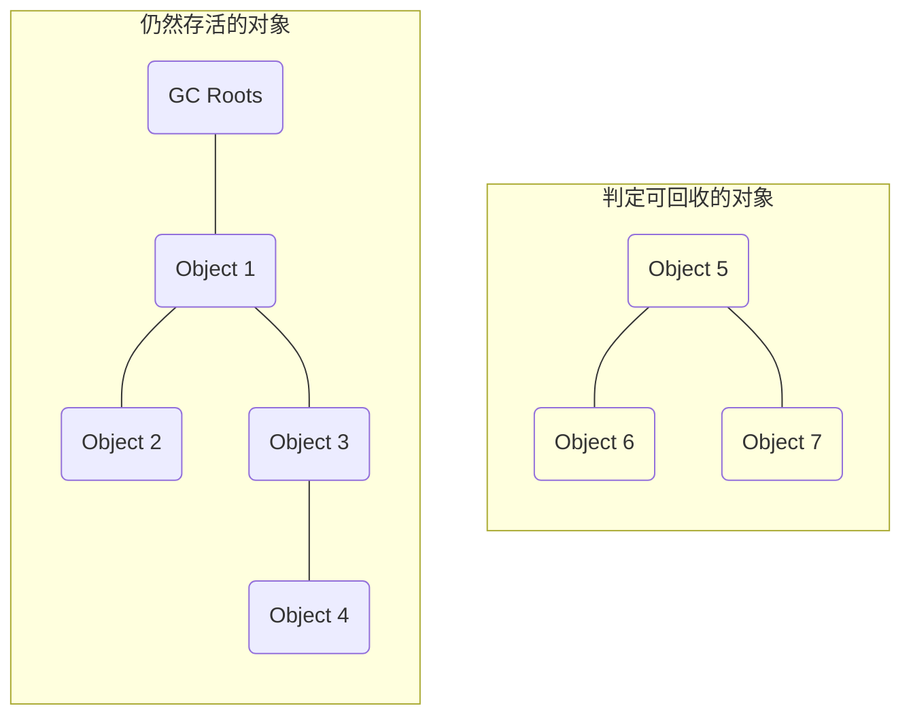
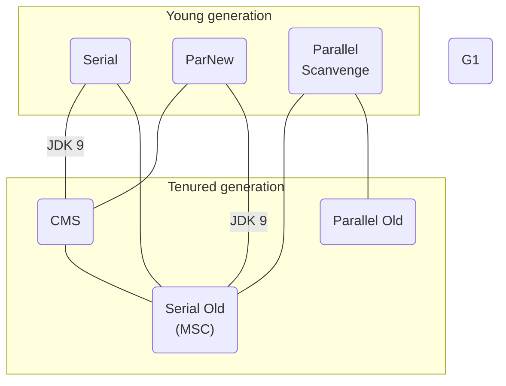

深入理解Java虚拟机系列——第2部分：自动内存管理

1. Java虚拟机里的内存的区域划分，各个区域出现内存溢出异常的原因及如何避免；
2. Java虚拟机中自动内存分配及回收的主要规则；

<!--more-->

## 1. Java内存区域与内存溢出异常

引言：*“Java与C++之间有一堵由内存动态分配和垃圾收集技术所围成的高墙，墙外面的人想进去，墙里 面的人却想出来。”*

Java虚拟机内存的各个区域的作用、服务对象以及其中可能产生的问题，这也是*“翻越虚拟机内存管理这堵围墙的第一步”*。

### 1.1 🗄 运行时数据区域

Java虚拟机在执行Java程序的过程中会把它所管理的内存划分为若干个不同的数据区域。这些区域有各自的用途及创建和销毁的时间，有的区域随着虚拟机进程的启动而一直存在，有些区域则是依赖用户线程的启动和结束而建立和销毁。根据《Java虚拟机规范》的规定，Java虚拟机所管理的内存将会包括以下几个运行时数据区域：

#### 程序计数器

**程序计数器（Program Counter Register）**是一块较小的内存空间，可以看做是**当前线程所执行字节码的行号指示器**。在Java虚拟机的概念模型里，字节码解释器工作时就是通过改变这个计数器的值来选取下一跳需要执行的字节码指令，它是程序控制流的指示器，分支、循环、跳转、异常处理、线程恢复等基础功能都需要依赖这个计数器来完成。

#### Java虚拟机栈

与程序计数器一样，**Java虚拟机栈（Java Virtual Machine Statcks）**描述的是Java执行的线程内存模型：**每一个方法被调用直至执行完毕的过程**，就对应着一个**栈帧在虚拟机栈中从创建到入栈到出栈的过程**。

**栈帧（Statck Frame）**用于存储局部变量表、操作数栈、动态连接、方法出口等信息。

#### 本地方法栈

**本地方法栈（Native Method Stacks）**与虚拟机栈所发挥的作用是相似的，其区别只是虚拟机栈为虚拟机执行Java方法（字节码）服务，而本地方法栈则是**为虚拟机使用到的本地方法（Native）服务**。

#### Java堆

**Java堆（Java Heap）**是虚拟机所管理的内存中最大的一块；**Java堆是被所有线程共享的一块内存区域**，在虚拟机启动时创建。此内存区域的唯一目的就是**存放对象实例**。

#### 方法区

**方法区（Method Area）**与Java堆一样，是各个线程共享的内存区域，它**用于存储已被虚拟机加载的类型信息、常量、静态变量、即时编译器编译后的代码缓存等数据**。

这个区域的内存回收目标主要针对常量池的回收和对类型的卸载。

#### 运行时常量池

**运行时常量池（Runtime Constant Pool）**是方法区的一部分；Class文件中除了有类的版本、字段、方法、接口等描述信息外， 还有一项信息是常量表（Constant Pool Table）——**用于存放编译期生成的各种字面量与符号引用**，这部分内容将在类加载后存放到方法区的运行时常量池中。

运行时常量池相对于Class文件常量池的另外一个重要特征是具备**动态性**，Java语言并不要求常量一定只有编译期间才能生成，运行期间也可以将新的常量放入池中，这种特性被开发人员利用得比较多的是 `String.intern()` 方法。

#### 直接内存

**直接内存（Direct Memory）**并不属于虚拟机运行时数据区的一部分，也不是《Java虚拟机规范》中定义的内存区域；但是这部分内存也被频繁地使用；本机直接内存的分配不会受到Java堆大小的限制，但还是会受到本机总内存（包括物理内存、SWAP分区或者分页文件）大小以及处理器寻址空间的限制。

譬如：JDK 1.4加入的*NIO（New Input/Output）*类，引入的一种基于通道（Channel）与缓冲区（Buffer）的I/O方式，它可以使用Native函数库直接分配堆外内存，然后通过一个存储在Java堆里的`DirectByteBuffer`对象作为这块内存的引用进行操作；这样避免了Java堆和Native堆中来回复制数据的开销，在某些场景中提高了性能。

### 1.2 🤖 HotSpot虚拟机对象探秘

深入探讨HotSpot虚拟机在Java堆中分配对象、布局和访问的全过程。

#### 对象的创建

当Java虚拟机遇到一条字节码`new`指令时，创建对象的全过程：

1. 首先检查`new`指令的参数是否能在常量池中定位到一个类的符号引用，并检查者符号引用代表的类是否已被加载、初解析和初始化过；如果没有，先执行相应的类加载过程；
2. 类加载检查通过后，将为新生对象分配内存，对象所需内存的大小在类加载时完全确定，为对象分配内存空间，即**把一块确定大小的内存块从Java堆中划分出来**；
3. 内存分配完后，必须将内存空间（不包括对象头）初始化为零值，这一步保证了对象的实例字段在Java代码中可以不赋初始值就可以直接使用；
4. 接下来要对对象进行必要的对象头信息设置，例如：这个对象是哪个类的实例、如何能找到类的元数据信息等；
5. 这时，从虚拟机的角度来看，一个新的对象已经产生了，但从Java程序的角度来看，对象刚创建，而构造函数（即Class文件中的`<init>()`）还没执行；只有按照Java程序预定的意图进行初始化，一个真正可用的对象才算完全被构造出来。

在内存分配过程中，可根据Java堆内存情况区分不同的内存分配方式，选择哪种方式由Java堆是否规整而定，而Java堆是否规整又由所采用的垃圾收集器是否带有空间压缩整理（Compact）的能力决定。

##### 内存分配方式：指针碰撞

当Java堆中内存是绝对规整时，所有被使用的内存都在一侧，空闲的内存在另一侧，中间存放着一个指针作为分界点的指示器，分配内存仅仅是指针向空闲空间挪动一段域对象大小相等的距离，这种方式称为**指针碰撞（Bump The Pointer）**。

##### 内存分配方式：空闲列表

但如果Java堆中内存并不规整，无法使用指针碰撞，虚拟机通过维护一个列表，记录可用内存块信息，在分配内存时从列表找到一块足够大的空间划分给对象实例，并更新列表上的记录，这种方式称为**空闲列表（Free List）**。

##### 内存分配在并发情况下的线程安全问题

假设正在给对象A分配内存，指针还没来得及修改，对象B又同时使用原来的指针来分配内存的情况。

解决这个问题有两种可选方案：

1. 对分配及内存空间的动作进行同步处理——实际上虚拟机是采用（CAS[^CAS]+失败重试）的方式保证更新操作的原子性；
2. 把内存分配的动作按照线程划分在不同的空间进行，为每个线程预先分配一块内存[^TLAB]，这样分配内存动作就限制在当前线程中。

#### 对象的内存布局

在HotSpot虚拟机里，对象在堆内存中的存储布局可划分为三个部分：对象头（Header）、实例数据（Instance Data）和对齐填充（Padding）：

- **对象头（Header）**部分包括两类信息：

  1. 用于存储对象自身的运行数据，官方称为“**Mark Word**”，考虑到虚拟机的空间效率，*“Mark Word”*被设计成一个有着动态定义的数据结构，如表所示：

     | 存储内容                             | 标志位 | 状态               |
     | ------------------------------------ | ------ | ------------------ |
     | 对象哈希码、对象分代年龄             | 01     | 未锁定             |
     | 指向锁记录的指针                     | 00     | 轻量级锁定         |
     | 只想重量级锁的指针                   | 10     | 膨胀（重量级锁定） |
     | 空，不需要记录信息                   | 11     | GC标记             |
     | 偏向线程ID、偏向时间戳、对象分代年龄 | 01     | 可偏向             |

  2. **类型指针**，即对象指向它的类型元数据的指针，Java虚拟机通过这个指针来确定该对象是哪个类的实例。

- **实例数据（Instance Data）**，即定义的各种类型的字段内容。

- **对齐填充（Padding）**，仅仅起着占位符的作用，非必然存在。由于HotSpot虚拟机的内存管理系统要求对象起始地址必须是8字节的整数倍，换句话说，任何对象的大小都必须是8字节的整数倍。因此，如果对象实例数据部分没有对齐的话，就需要通过对其填充来补全。

#### 对象的访问定位

 对创建后的对象的访问，首先Java程序会通过栈上的`reference`数据来操作堆上的具体对象，主流的访问方式主要有：

##### 句柄访问对象

使用句柄访问，Java堆中将可能会划分出一块内存来作为句柄池，`reference`中存储的就是对象的句柄地址，而句柄中包含了对象实例数据与类型数据各自具体的地址信息。

**优势**：`reference`中存储的是稳定句柄地址，在对象被移动（垃圾收集时移动对象是非常普遍的行为）时只会改变句柄中的实例数据指针，而`reference`本身不需要被修改。

##### 直接指针访问对象

使用直接指针访问，`reference`中存储的直接就是对象地址，如果只是访问对象本身的话，就不需要第一次的间接访问开销。HotSpot虚拟机主要使用这种方式进行对象访问。

**优势**：速度更快，节省了一次指针定位的时间开销，由于对象访问在Java中非常频繁，因此这类开销积少成多也是一项极为可观的执行成本。

### 1.3 🐞 OutOfMemoryError 异常

除了程序计数器外，虚拟机内存的其他几个运行时区域都有发生`OutOfMemoryError`异常的可能。

#### Java堆溢出

Java堆用于存储对象实例，随着对象不断地创建（保证GC Root到对象之间有可达路径避免垃圾回收机制清理），总容量触及最大堆的容量限制后就会产生内存溢出异常。

#### 虚拟机栈和本地方法栈溢出

1. 如果线程请求的栈深度大于虚拟机所允许的最大深度，将抛出`StackOverflowError`异常；
2. 如果虚拟机的栈内存允许动态扩展，当扩展栈容量无法申请到足够的内存时，将抛出`OutOfMemoryError`异常；

#### 方法区和运行时常量溢出

1. 从JDK 7起，原本存放在永久代的字符串常量池被移至Java堆中，运行时字符串常量池溢出时，将抛出`OutOfMemoryError`异常；
2. **方法区主要职责是用于存放类型的相关信息，如类名、访问修饰符、常量池、字段描述、方法描述等**；当运行时产生大量的类填满方法区并溢出时，将抛出`OutOfMemoryError`异常；

#### 本机直接内存溢出

因为虽然使用`DirectByteBuffer`分配内存也会抛出内存溢出异常，但它抛出异常时并没有真正向操作系统申请分配内存，而是通过计算得知内存无法分配就会在代码里手动抛出溢出`OutOfMemoryError`异常。

直接内存导致的内存溢出，一个明显的特征是Heap Dump文件看不见明显的异常情况，当程序中使用了DirectMemory（NIO）时，就可以考虑重点检查下直接内存方面的原因了。

## 2. 垃圾收集器与内存分配策略

垃圾收集（Garbage Collection, GC）主要完成三件事情：

1. 哪些内存需要回收？
2. 什么时候回收？
3. 如何回收？

在Java堆和方法区这两个区域中，有着很明显的不确定性：一个接口的多个实现类需要的内存可能不一样，一个方法所执行的不同条件分支所需要的内存也可能不一样，只有处于运行期间，才能知道程序究竟会创建了哪些对象，这部分内存的分配和回收是动态的；而垃圾收集器所关注的主要就是这部分（动态的、运行期间的）内存如何管理。

### 2.1 🪦 对象已死？

垃圾收集器在对堆进行回收前，第一件事情就是要确定这些对象之中哪些还*“存活”*，哪些已*“死去”*。

#### 可达性分析算法

主流语言Java、C#是通过**可达性分析（Reachability Analysis）**算法来判定对象是否存活，这个算法的思路是通过一些列称为*"GC Roots"*的根对象作为起始点集，从这些节点开始，根据引用关系向下搜索，搜索过程走过的路径为*“引用链”（Reference Chain）*，如果某个对象到GC Roots间没有任何引用链相连，或者用图论的话来说就是**从GC Roots到这个对象不可达时，则证明此对象是未被引用的**。

在Java技术体系里面，固定可作为GC Roots的对象包括以下几种：

- 虚拟机栈（栈帧中的本地变量表）中引用的对象，譬如各个线程被调用的方法堆栈中使用到的参数、局部变量、临时变量等；
- 方法区中类静态属性引用的对象，譬如Java类的引用类型静态变量；
- 方法区中常量引用的对象，譬如字符串常量池（String Table）里的引用；
- 本地方法栈中JNI（即通常所说的Native方法）引用的对象；
- Java虚拟机内部的引用，如基本数据类型对应的Class对象，一些常驻的异常对象（比如 `NullPointExcepiton`、`OutOfMemoryError`）等，还有系统类加载器；
- 所有被同步锁（`synchronized`关键字）持有的对象
- 反映Java虚拟机内部情况的JMXBean、JVMTI中注册的回调、本地代码缓存等；

#### 再谈引用

在JDK 1.2之后，Java堆引用的概念进行了扩充，用于描述一类对象：**当内存空间充足时，能继续保留；当进行垃圾收集后内存仍然紧张，将抛弃这些对象**；将引用分为以下4种，引用强度依次逐渐减弱：

- **强引用（Strongly Re-ference）**指在程序代码中普遍存在的引用赋值，即类似 `Object obj = new Object()` 这种关系。无论任何情况下，只要强引用关系还存在，垃圾收集器就永远不会回收被引用的对象。
- **软引用（Soft Reference）**用于描述一些还有用，但非必须得对象；在系统将要发生内存溢出异常前，会把这些对象列入回收范围之中进行第二次回收，如果回收后还没足够的内存，才会抛出内存溢出异常。
- **弱引用（Wak Reference）**相对于软引用，它的轻度比软引用更弱一些，被引用关联的对象只能生存到下一次垃圾收集发生为止。当垃圾收集器开始工作，无论当前内存是否足够，都会回收掉只被引用关联的对象。
- **虚引用（Phantom Reference）**：一个对象是否有虚引用的存在，完全不会对其生存时间构成影响，也无法通过虚引用来获得一个对象实例；为一个对象设置虚引用关联的唯一目的只是**为了这个对象被垃圾收集器回收时收到一个系统通知**。

#### 生存还是死亡？

一个对象走向*“死亡”*，至少要经历两次标记过程：

1. 第一次标记：可达性分析判定为不可达
2. 第二次标记：进行是否必要执行`finalize()`方法筛选来确定是否进行回收

#### 回收方法区

方法区的垃圾收集主要回收两部分内容：**废弃的常量**和**不再使用的类型**。

判断一个常量是否*“废弃”*相对简单，即没有对象引用该字面量；而判断一个类型是否属于*“不再被使用的类”*需要同时满足以下三个条件：

- 该类所有的实例都已被回收，即Java堆中不存在该类及其任何派生子类的实例；
- 加载该类的类加载器已经被回收；
- 该类对应的`java.lang.Class`对象没有任何地方被引用，无法在任何地方通过反射访问该类的方法；

满足上述三个条件的无用类型仅仅是*“被允许”*回收，决定是否进行回收由HotSpot提供的参数进行控制。

### 2.2 📐 垃圾收集算法

垃圾收集算法可以划分为**“引用计数式垃圾收集”（Reference Counting GC）**和**“追踪式垃圾收集”（Tracing GC）**两大类，这两类也常被称作*“直接垃圾收集”*和*“间接垃圾收集”*。

#### 分代收集理论

当代商业虚拟机的垃圾收集器，大多数都遵循了**“分代收集”（Generational Collection）**的理论，而理论是建立在两个分代假说之上：

1. **弱分代假说（Weak Generational Hypothesis）**：绝大多数对象都是朝生夕灭的；
2. **强分代假说（Strong Generational Hypothesis）**：熬过越多次垃圾收集过程的对象就越难以消亡；

这两个假说共同奠定了多数垃圾收集器的设计原则：收集器应该将Java堆划分出不同的区域，然后将回收对象依据其年龄（年龄即对象熬过垃圾收集过程的次数）分配到不同的区域之中存储。这样**每次回收时只关注如何保留少量存活，而不是去标记哪些大量要被回收的对象，就能以较低的代价回收到大量的空间，同时兼顾了垃圾收集的时间开销和内存空间的有效利用**。

在Java堆划分出不同的区域之后，就有了*"Minor GC"*、*"Major GC"*、*"Full GC"*这样的回收类型的划分，从而能够针对不同的区域安排与里面存储对象存亡特征相匹配的垃圾收集算法，如*“标记-复制算法”*、*“标记-消除算法”*、*“标记-整理算法”*等针对性的垃圾收集算法。

在分代收集理论的不断发展中发现一个明显的困难：**对象不是孤立的，对象之间会存在跨代引用**。为了解决这个问题就需要分代收集理论添加第三条经验法则：

3. **跨代引用假说（Inergenerational Reference Hypothesis）**：跨代引用相对于同代引用来说仅占极少数；

不同分代的名词定义：

**部分收集（Partial GC）**: 指目标不是完整收集整个Java堆的垃圾收集，其中又分为：

- **新生代收集（Minor GC/Young GC）**：指定目标是新生代的垃圾收集；
- **老年代收集（Major GC/Old GC）**：指定目标是老年代垃圾收集；
- **混合收集（Mixed GC）**：指定目标是整个新生代以及老年代的垃圾收集；

**整堆收集（Full GC）**：收集整个Java堆的和方法区的垃圾收集。

#### 标记-清除算法

**“标记-清除”（Mark-Sweep）**是最基础的收集算法，首先标记出所有需要回收的对象，在标记完成后，统一回收掉所有被标记的对象；或者也可以反过来，标记存活的对象，统一回收所有未被标记的对象。

后续的收集算法大多都是以*“标记-清除”*算法为基础，对其缺点进行改进得来的；而*“标记-清除”*主要的缺点有：

1. 执行效率不稳定，如果Java堆中包含大量需要被回收的对象时，必须进行大量标记和清除动作，导致执行效率随对象整长而降低；
2. 内存空间的碎片化问题，标记、清除之后会产生大量不连续的内存碎片，空间碎片太多可能会导致以后在程序运行过程中需要分配较大对象时无法找到足够的连续内存而不得不出发另一次垃圾收集动作；

#### 标记-复制算法

为了解决*“标记-清除”*在面对大量可回收对象执行效率低的问题；首先将可用内存一分为二，当这一块的内存用完了，就将还存活着的对象复制到另外一块上面，然后再把已使用过的内存空间一次清理掉。

这种算法在对象存活率较高时就要进行较多的复制操作，效率会降低。相反，只需要复制少数的存活对象，效率就越高。

目前大多数商用Java虚拟机回收**新生代**优先采用**“标记-复制（Mark-Copy）”**算法去。

#### 标记-整理算法

面对**老年代**对象的存亡特征，存在被使用的内存中所有对象都100%存活的极端情况，则出现了有针对性的**“标记-整理”（Mark-Compact）**算法，其中标记过程与*“标记-清除”*算法一样，但后续步骤是让所有存活的对象都向内存空间一端移动，然后清理掉边界以外的内存，而是否移动回收后的存活对象是一项优缺点并存的风险决策：

- 若移动大量存活对象将会是一种极为负重的操作，尤其在老年代这种每次回收都有大量对象存活区域的情况；并且操作过程会全程暂停用户程序；
- 面对弥散于对重的存活对象，不进行移动清理的话会导致空间碎片化问题，这样只能依赖更为复杂的内存分配器和内存访问器来解决了； 

### 2.3 🗑 经典垃圾收集器

如果说收集算法是内存回收的方法论，那垃圾收集就是内存回收的实践者。

各款经典收集器之间搭配使用的关系：

#### Serial收集器

Serial收集器在进行垃圾收集时，必须暂停其他工作线程，直到它收集结束。所以会给用户带来*“Stop The World”*的糟糕体验。迄今为止，它依然是HotSpot虚拟机运行在客户端模式下的默认**新生代收集器**。

#### Par New收集器

**Part New收集器**是Serial收集器的多线程并行版本；多数运行在服务端模式下的HotSpot虚拟机，除了Serial收集器外，目前只有它能与CMS收集器配合工作，但自JDK9开始，官方希望它能完全被G1收集器取代，从此以后ParNew合并入了CMS，成为它专门处理新生代的组成部分。可以说ParNew是HotSpot虚拟机中第一款退出历史舞台的垃圾收集器。

#### Parallel Scavenge收集器

**Parallel Scavenge收集器**是一款**新生代收集器**，同样是基于*“标记-复制”*算法实现的收集器，也是能够并行收集的多线程收集器，与ParNew相似；Parallel Scavenge收集器的特点是它的目标是达到一个可控制的吞吐量[^吞吐量]，即：
$$
吞吐量 = \frac{运行用户代码时间}{运行用户代码时间 + 运行垃圾收集时间}
$$

#### Serial Old收集器

**Serial Old收集器**是Serial收集器的**老年代**版本，它同样是一个单线程收集器，使用*“标记-整理”*算法。主要是供客户端模式下的HostSpot虚拟机使用；如果在服务端模式下，它可能有两种用途：

1. JDK 5版本及之前，与Parallel Scavenge收集器搭配使用；
2. JDK 6版本开始作为CMS收集器发生失败时的后背预选方案；

#### Paraqllel Old收集器

**Parallel Old收集器**是Parallel Scavenge收集器的**老年代**版本，支持多线程并发收集，基于*“标记-整理算法”*实现。

#### CMS收集器

**CMS（Concurrent Mark Sweep）收集器**是一种**以获取最短回收停顿时间为目标的收集器**，基于*“标记-清除”*算法现；通常用于较关注服务的响应速度，希望系统停顿时间尽可能短，以给用户带来良好的用户体验的应用上。

整个运作过程分为四个步骤：

1. 初始标记（CMS initial mark）
2. 并发标记（CMS concurrent mark）
3. 重新标记（CMS remark）
4. 并发清除（CMS concurrent sweep）

CMS主要的优点有：并发收集和低停顿，但缺点也很明显：

- 对处理资源非常敏感，并发阶段会占用一部分线程；
- 无法处理*“浮动垃圾”*[^浮动垃圾]；
- 收集结束时会有大量空间碎片产生；

#### Garbage First收集器

Garbage First简称G1，开创了**面向局部收集的设计思路和基于Region的内存布局形式**，虽然G1也仍是遵循分代收集理论设计，但其堆内存的布局不再坚持固定大小以及固定数量的分代区域划分，而是**把连续的Java堆划分为多个大小相等的独立区域（Region）**，每个独立的Region通过动态分配方式实现逻辑上的连接，每一个Region都可以根据需要，扮演新生代的**Eden空间**、**Survivor空间**，或者老年代空间。每个Region都是通过指针碰撞来分配空间。

G1收集器的运作过程大致可划分为以下四个步骤：

- 初始标记（Initial Marking）
- 并发标记（Concurrent Marking）
- 最终标记（Final Marking）
- 筛选回收（Live Data Counting and Evacuation）

### 2.4 🔄 内存分配与回收策略

Java技术体系的自动内存管理，最根本的目标是自动化地解决两个问题：自动分配和回收对象的内存。

本节以HotSpot虚拟机在客户端模式下运行，并指定Serial+Serial Old收集器组合的内存分配和回收策略展开讨论：

#### 对象优先在Eden区分配

大多数情况下，对象在新生代Eden区中分配；当Eden区没有足够空间进行分配时，虚拟机将发起 一次Minor GC。

#### 大对象直接进入老年代

最典型的需要大量连续存储空间的Java对象，譬如：很长的字符串或者元素数量庞大的数组，在虚拟机分配空间时，若内存充足但没有足够大的连续内存空间时会容易导致提前触发GC，而当复制对象时，大对象就意味着有高额的内存复制开销；编写代码时应注意避免。

#### 长期存活的对象将进入老年代

在“分代收集”理论设计中，Java虚拟机通过给每个对象定义一个对象年龄计数器，并存储在对象头中；对象通常在Eden区里诞生，如果经过第一次Minor GC后仍然存活，并且能被Survivor容纳时，移到Survivor空间并年龄设为1岁，当对象在Survivor区没熬过一次Minor GC，年龄就增加1岁，当它的年龄增加到一定程度（默认15岁），就会被晋升到老年代中。

#### 动态对象年龄判定

对于上述的对象年龄设计，并不总是要求对象的年龄达到某个程度才能晋升老年代，譬如在Survivor空间中相同年龄所有对象大小的总和大于Survivor空间的一半，大于或等于该年龄的对象就可以直接进入老年代；这样是为了更好地适应不成程序的内存状况。

参考文献：

[深入理解Java虚拟机：JVM高级特性与最佳实践（第3版）—周志明](https://read.douban.com/ebook/128052544/)

> 「深入理解JVM」系列为阅读笔记，如有侵权请第一时间联系删除， 谢谢！
>
> <mcgrady911@foxmail.com>

[^TLAB]: 本地线程分配缓冲（Thread Local Allocation Buffer, TLAB）
[^OSGi]: Open Service Gateway Initiative 是OSGi联盟指定的一个基于Java语言的动态模块化规范。
[^吞吐量]: 吞吐量（Throughput）是处理器用于运行用户代码的时间与处理器总消耗时间的比值。
[^浮动垃圾]: 浮动垃圾（Floating Garbage）在CMS的并发标记和并发清理阶段，用户线程是还在继续运行的，程序在运行自然就还会伴随有新的垃圾对象不断产生，但这一部分垃圾对象是出现在标记过程结束以后，CMS无法在当次收集中处理掉它们，只好留待下一次垃圾收集时再清理掉。这一部分垃圾就称为“浮动垃圾”。
[^CAS]: （Compare And Swap）比较并交换操作