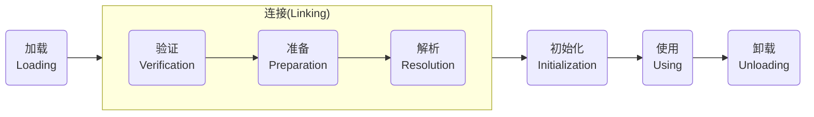
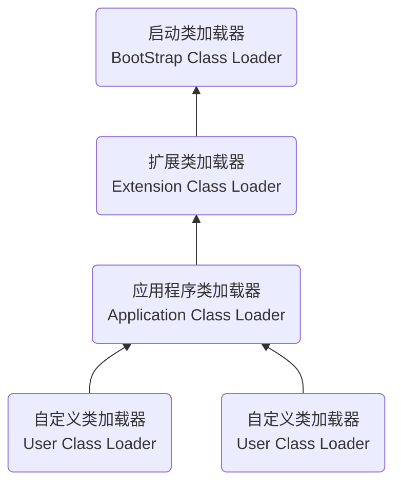

深入理解Java虚拟机系列——第3部分：虚拟机执行子系统

1. 类文件结构
2. 虚拟机类加载机制
3. 虚拟机字节码执行引擎

<!--more-->

## 1. 类文件结构

引言：*代码编译的结果从本地机器码转变为字节码，是存储格式发展的一小步，确实编程语言发展的一大步。*

Class文件是Java虚拟机执行引擎的数据入口，也是Java技术体系的最基础的支柱之一。

### 1.1 📃 Class文件结构

任何一个Class文件都对应着唯一的一个类或接口的定义信息。

**Class文件是一组以8个字节为基础单位的二进制流**，各个数据项目严格按照顺序紧凑地排列在文件之中，中间没有添加任何分隔符，这使得整个Class文件中存储的内容几乎全部都是程序运行的必要数据。当遇到需要占用8个字节以上空间的数据项时，则会按照高位在前的方式分割成若干个8字节进行存储。

根据《Java虚拟机规范》的规定，Class文件格式采用一种类似于C语言结构体的伪结构来存储数据，这种伪结构中只有两种数据类型：*“无符号数”*和*“表”*。后面的解析都要以这两种数据类型为基础。

- **无符号数**：属于基本数据类型，以 `u1`、`u2`、`u4`、`u8`来分别代表**1**个字节、**2**个字节、**4**个字节和**8**个字节的无符号数，无符号数可以用来描述**数字**、**索引引用**、**数量值**或按照UTF-8编码构成的**字符串值**。
- **表**：是由多个无符号数或者其他表作为数据项构成的复合数据类型，为了便于区分，所有表的命名都习惯性地以 *"_info"* 结尾。用于描述**有层次关系的符合结构的数据**，整个Class文件本质上也可以视为一张表，这张表由以下的数据项按严格顺序排列构成：


无论是无符号数还是表，对那个需要描述同一类型但数量不定的多个数据时，经常会使用一个前置的容量计数器加若干个联系的数据项的形式，这时候称这一些列连续的一类型的数据为某一类型的“集合”。

#### 魔数与Class文件的版本

每个Class文件的**头4个字节**被称为**魔数（Magic Number）**，它的唯一作用是确定这个文件是否为一个能被虚拟机接受的Class文件；**0xCAFEBABE** 作为Java语言的魔数值。

紧接着魔数后面的4个字节存储的是Class文件的版本号，其中第5和第6个字节是次版本号（Minor Version），第7和第8个字节是主版本号（Major Version）。

#### 常量池

接着版本号之后是常量池入口，常量池可以比喻为Class文件里的资源仓库，它是Class文件结构中与其他项目关联最多的数据，通常也是占用Class文件空间最大的数据项目之一。

由于常量池中常量的数量是不固定的，所以在常量池的入口需要放置一项 `u2` 类型数据，代表*常量池容量计数值（constant_pool_count）*。

常量池主要存放两大类常量：

- **字面量（Literal）**：比较接近于Java语言层面的常量概念，如**文本字符串**、**被声明为`final`的常量值**等。
- **符号引用（Sysmbolic References）**：属于编译原理方面的概念，主要包括下面几类常量：
  - 被模块导出或开放的包（Package）
  - 类和接口的全限定名（Fully Qualified Name）
  - 字段的名称和描述符（Field Descriptor）
  - 方法的名称和描述符（Method Descriptor）
  - 方法句柄和方法类型（Method Handle、Method Type、Invoke Dynamic）
  - 动态调用点和动态常量（Dynamically-Computed Call Site、Dynamically-Computed Constant）

常量池中每一项常量都是一个表，多达17种常量类型，各自有着完全独立的数据结构：

| 常量项类型                       | 标志位 | 含义                                                         |
| :------------------------------- | :----- | ------------------------------------------------------------ |
| CONSTANT_Utf8_info               | 1      | UTF-8编码字符串                                              |
| CONSTANT_Integer_info            | 3      | 整型字面量                                                   |
| CONSTANT_Float_info              | 4      | 浮点型字面量                                                 |
| CONSTANT_Long_info               | 5      | 长整型字面量                                                 |
| CONSTANT_Double_info             | 6      | 双精度浮点型字面量                                           |
| CONSTANT_Class_info              | 7      | 类/接口的符号引用                                            |
| CONSTANT_String_info             | 8      | 字符串字面量，存储了指向`CONSTANT_Utf8_info`的索引           |
| CONSTANT_Fieldref_info           | 9      | 字段（成员变量）的符号引用                                   |
| CONSTANT_Methodref_info          | 10     | 类中方法的符号引用                                           |
| CONSTANT_InterfaceMethodref_info | 11     | 接口中方法的符号引用                                         |
| CONSTANT_NameAndType_info        | 12     | 字段或方法的部分符号引用                                     |
| CONSTANT_MethodHandle_info       | 15     | 方法句柄，和反射有关，对应`java.invoke.MethodHandle`         |
| CONSTANT_MethodType_info         | 16     | 方法类型，只包含函数的参数类型和返回值类型，不包括函数名和所属类名 |
| CONSTANT_Dynamic_info            | 17     | 一个动态计算常量                                             |
| CONSTANT_InvokeDynamic_info      | 18     | 一个动态方法调用点，用于`invokeDynamic`指令                  |
| CONSTANT_Module_info             | 19     | 一个模块                                                     |
| CONSTANT_Package_info            | 20     | 一个模块中开放或者导出的包                                   |

####  访问标志

在常量池结束后，紧接着的**2**个字节代表访问**标志（access_flag），用于识别一些类或者接口层次的访问信息，包括：

| 标志名称       | 标志值 | 含义                                          |
| -------------- | ------ | --------------------------------------------- |
| ACC_PUBLIC     | 0x0001 | 是否为`public`类型                            |
| ACC_FINAL      | 0x0010 | 是否被声明为`final`，只有类可设置             |
| ACC_SUPER      | 0x0020 | 是否允许使用`invokespecial`字节码指令的新语义 |
| ACC_INTERFACE  | 0x0200 | 标识这是一个接口                              |
| ACC_ABSTRACT   | 0x0400 | 是否为`abstract`类型                          |
| ACC_SYNTHETIC  | 0x1000 | 标识这个类并非由用户代码产生的                |
| ACC_ANNOTATION | 0x2000 | 标识是一个注解                                |
| ACC_ENUM       | 0x4000 | 标识是一个枚举                                |
| ACC_MODULE     | 0x8000 | 标识是一个模块                                |

#### 类索引、父类索引与接口索引集合

**类索引（this_class）**和父类索引（super_class）都是一个 `u2` 类型的数据，而**接口索引集合（interfaces）**是一组 `u2` 类型的数据的集合，这三项数据确定了该类的类型的继承关系：

- 类索引用于确定这个类的全限定名
- 父类索引用于确定这个类的父类的全限定名
- 接口索引集合用来描述这个类实现了哪些接口

#### 字段表集合

**字段表（field_info）**用于描述接口或类中声明的变量。Java语言层面的*“字段”（Field）*包括**类级变量**、**实例级变量**，但不包括在方法内部声明的局部变量。

字段的描述信息包括：

- 作用域（`public`、`private`、`protected`修饰符）
- 实例变量还是类变量（`static`修饰符）
- 可变性（`final`修饰符）
- 并发可见性（`volatile`修饰符）
- 可否序列化（`transient`修饰符）
- 字段数据类型（基本类型、对象、数组）
- 字段名称

上述信息中，修饰符都是布尔值，数据类型则使用对应的字符串来描述：

- 基本类型对应的字符串描述为 `B` `C` `D` `F` `I` `J` `S` `Z` 分别对应 `byte` `char` `double` `float` `int` `long` `short` `boolean`；
- 对象的引用类型数据的格式为`LClassNname`，对应类的全路径名，譬如`String`描述为`Ljava/lang/String`；
- 数组也是一种引用类型，用`[类型描述名`表示，譬如一个`int`数组描述为`[I`

字段表结构：

| 名称             | 类型           | 数量             | 含义                               |
| ---------------- | -------------- | ---------------- | ---------------------------------- |
| access_flag      | u2             | 1                | 访问标志                           |
| name_index       | u2             | 1                | 字段名称，没有类型和参数修饰       |
| descriptor_index | u2             | 1                | 字段描述符，用于描述字段的数据类型 |
| attributes_count | u2             | 1                | 属性表计数器                       |
| attributes       | attribute_info | attributes_count | 属性表                             |


#### 方法表集合

方法表集合的描述与字段的描述几乎一致，仅在访问标志和属性表集合的可选项中有所区别。因为 `volatile` `transient` 关键字不能修饰方案，所以方发表的访问标志中没有，与之相对的 `synchronized` `native` `strictfp` `abstact` 关键字可以修饰方法，方发表的访问标志中也相应地增加了对应的标志。

方法表结构：

| 类型           | 名称             | 数量             | 含义         |
| -------------- | ---------------- | ---------------- | ------------ |
| u2             | access_flags     | 1                | 访问标志     |
| u2             | name_index       | 1                | 方法名称     |
| u2             | descriptor_index | 1                | 方法描述符   |
| u2             | attributes_count | 1                | 属性表计数器 |
| attribute_info | attributes       | attributes_count | 属性表       |

#### 属性表集合

Class文件、字段表、方法表都可以携带自己的**属性表（attribute_info）集合**，以描述特定场景的专有信息。对于每个属性，它的名称都要从常量池中引用一个`CONSTANT_Utf8_info`类型的常量来表示，而属性值的结构则是完全自定义的，只需要通过一个`u4`的长度去说明属性值占用的位数即可。

属性表结构：

| 名称                 | 类型 | 数量             |
| -------------------- | ---- | ---------------- |
| attribute_name_index | u2   | 1                |
| attribute_length     | u4   | 1                |
| info                 | u1   | attribute_length |

##### 1. Code属性

方法的定义可以通过访问标志、名称索引、描述符索引来表达清楚，但方法里面的代码经过Javac编译成字节码指令之后，存放在方法属性表集合中一个名为*"Code"*的属性表里面：

| 名称                   | 类型           | 数量                   | 含义                                                 |
| ---------------------- | -------------- | ---------------------- | ---------------------------------------------------- |
| attribute_name_index   | u2             | 1                      | 指向`CONSTANT_Utf8_info`型常量的索引，固定值为`Code` |
| attribute_length       | u4             | 1                      | 属性值长度                                           |
| max_stack              | u2             | 1                      | 操作数栈深度的最大值                                 |
| max_locals             | u2             | 1                      | 局部变量表所需的存储空间，单位是变量槽（Slot）       |
| code_length            | u4             | 1                      | 字节码指令长度                                       |
| code                   | u1             | code_length            | 字节码指令                                           |
| exception_table_length | u2             | 1                      | 异常表长度                                           |
| exception_table        | exception_info | exception_table_length | 异常表                                               |
| attribute_count        | u2             | 1                      | 属性计数器                                           |
| attrbutes              | attrbute_info  | attrbutes_count        | 属性表                                               |

**Code**属性是Class文件中最重要的一个属性，如果把一个Java程序中的信息分为**代码**（Code，方法体内的Java代码）和元数据（Metadata，类、字段、方法定义等）两部分的话，Code属性用于描述代码，所有的其他数据项都用于描述元数据。

##### 2. Exceptions属性

**Exception**属性的作用是列举方法中可能抛出得受查异常（Checked Exceptions），也就是方法中`throws`关键字后面列举的异常。

##### 3. LineNumberTable属性

**LineNumberTable**属性用于描述Java源码行号与字节码行号（字节码的偏移量）之间的关系。

##### 4. LocalVariableTable及LocalVariableTypeTable属性

**LocalVariableTable**属性用于描述栈帧中局部变量表的变量与Java源码中定义的变量之间的关系。

**LocalVariableTypeTable**属性作为LocalVariableTable的*“姐妹属性”*，使用字段的特征签名来完成泛型的描述。

##### 5. SourceFile及SourceDebugExtension属性

**SourceFile**属性用于记录生成这个Class文件的源码文件名称，应对类名与文件名不一致的情况。

**SourceDebugException**属性用于存储额外的代码调试信息。

##### 6. ConstantValue属性

**ConstantValue**属性的作用是通知虚拟机自动为静态变量赋值，譬如同时使用`final`和`static`修饰的基本数据类型或String类型时，将会生成ConstantValue属性来进行初始化。

##### 7. InnerClasses属性

**InnerClass**属性用于记录内部类与宿主类之间的关联。

##### 8. Deprecated及Synthetic属性

Deprecated和Synthetic两个属性都属于标志类型的布尔属性，**Deprecated**属性用于表示某个类、字段或方法已经被程序作者定为不再推荐使用；**Syntheti**属性代表此字段或者方法并不是由Java源码直接生成，而是由编译器自行添加。

##### 9. StackMapTable属性

**StackMapTable**属性位于Code属性的属性表中，用于代替以前比较消耗性能的基于数据流分析的类型推导验证器（Type Checker）。

##### 10. Signature属性

**Signature**属性可以出现在类、字段表和方法表结构的属性表中，用于记录泛型签名信息。

##### 11. BootstrapMethods属性

**BootstrapMethods**属性位于类文件的属性表中，用于保存`invokedynamic`指令引用的引导方法限定符。

##### 12. MethodParameters属性

MethodParameters属性位于方法表中，用于记录方法的各个形参名称和信息。

##### 13. 模块化相关属性

**Module**属性表示该模块的名称、版本、标志信息外，还存储了这个模块`requires`、`exports`、`opens`、`uses`和`provides`定义的全部内容。

##### 14. 运行时注解相关属性

Class文件增加了**RuntimeVisibleAnnotations**、**RuntimeVisibleParameterAnnotations**、**RuntimeInvisibleAnnotations**、**RuntimeInvisibleParameterAnnotations**、**RuntimeVisibleTypeAnntations**、**RuntimeInvisibleTypeAnnotations**属性用于对Annotation注解的支持。


### 1.2 ⌥ 字节码指令简介

Java虚拟机的指令由一个字节长度的、代表着某种特定操作含义的数据（成为操作码，Opcode），以及跟随其后的零至多个代表此操作的参数（称为操作数，Oprand）构成。


## 2. 虚拟机类加载机制

Java虚拟机把类描述的数据从Class文件加载到内存，并对数据进行校验、转换解析和初始化，最终形成可以被虚拟机直接使用的Java类型，这个过程被称作虚拟机的类加载机制。

Java天生可以动态扩展的语言特性是依赖运行期动态加载和动态连接这个特点实现的。例如用户可以通过Java预置的或自定义类加载器，让某个本地的应用程序在运行时从网络或其他地方上加载一个二进制流作为其程序代码的一部分。这种动态组装应用的方式目前已广泛应用于Java程序之中，从最基础的Applet、JSP到相对复杂的OSGi技术，都依赖着Java语言运行期类加载才得以诞生。

### 2.1 ⏱ 类加载的时机

一个类型从被加载到虚拟机内存中开始，到卸载出内存为止，它的整个生命周期将会经历以下七个阶段，其中验证、准备、解析三个部分统称为连接（Linking）：




### 2.2 📥 类加载的过程

#### 加载

在*“加载”（Loading）*阶段，Java虚拟机需要完成以下三件事情：

- 通过一个类的全限定名来获取定义此类的二进制字节流
- 将这个字节流所代表的静态存储结构转化为方法区的运行时数据结构
- 在内存中生成一个代表这个类的`java.lang.Class`对象，作为方法区这个类的各种数据的访问入口

加载阶段结束后，Java虚拟机外部的二进制字节流存储至方法区之后，在Java堆内存中实例化一个`java.lang.Class`类的对象，这个对象将作为程序访问方法区中的类型数据的外部接口。

#### 验证

验证是连接阶段的第一步，这一阶段的目的是确保Class文件的字节流中包含的信息符合《Java虚拟机规范》的全部规约，保证这些信息被当做代码运行后不会危害虚拟机自身的安全。

从代码零和耗费的执行性能角度来看，验证阶段的工作量在虚拟机的类加载中占了相当大的比重。从整体上来看，验证阶段大致会完成下面四个阶段的校验动作：

- 文件格式验证
- 元数据验证
- 字节码验证
- 符号引用验证

#### 准备

准备阶段是正式为类中定义的变量（即静态变量，被`static`修饰的变量）分配内存并设置类变量初始值的阶段。

#### 解析

解析阶段是Java虚拟机将常量池内的符号引用替换为直接引用的过程。

**符号引用（Symbolic References）**：符号引用以一组符号来描述所引用的目标，符号可以是任何形式的字面量，只要使用时能无歧义地定位到目标即可。符号引用与虚拟机实现的内存布局无关，引用的目标并不一定是已经加载到虚拟机内存当中的内容。

**直接引用（Direct References）**：直接引用是可以直接指向目标的指针、相对偏移量或是一个能简介定位到目标的句柄。直接引用是和虚拟机实现的布局直接相关的，如果有了直接引用，那引用的目标必定已经在虚拟机的内存中存在。

解析动作主要针类或接口、字段、类方法、接口方法、方法类型、方法句柄和调用点限定符这些符号引用进行。

#### 初始化

类的初始化阶段是类加载过程的最后一个步骤，接下来Java虚拟机开始执行类中编写的Java程序代码，将主导权移交给应用程序。

初始化阶段可以理解为是：执行类构造器`<clinit>()`方法的过程，`<clinit>()`由编译器自动收集类中的所有类变量的赋值动作和`static{}`静态语句块中的语句合并产生的。

> 注意：由于在`<clinit>()`方法中，编译器收集类变量和静态语句块订单顺序是由语句源文件中出现的顺序决定的，所以静态聚聚快中只能访问定义在静态语句块之前的变量，定义在他之后的变量是不能访问的。

```java
public class Test {
  static {
    i = 0;
    System.out.print(i); 	//Error: 提示“非法向前引用”
  }
  static int i = 1;
}
```


### 2.3 🤖 类加载器

Java虚拟机设计团队有意把类加载阶段中的*“通过一个类的全限定名来获取描述该类的二进制字节流”*这个动作放到Java虚拟机外部去实现，以便让应用程序自己决定如何去获取所需的类。实现这个动作的代码被称为*“类加载器”（Class Loader）*。

#### 类与类加载器

对于 任意一个类，都必须由加载它的类加载器和这个类本身一起共同确立其在Java虚拟机中的唯一性，每一个类加载器，都拥有一个独立的类名称空间。

#### 双亲委派模型

站在Java虚拟机的角度来看，只存在两种不同的类加载器：一种是启动类加载器（Bootstrap ClassLoader），这个类加载器使用C++语言实现，是虚拟机自身的一部分；另外一种就是其他所有的类加载器，这些类加载器都由Java语言实现，独立存在于虚拟机外部，并且全都继承自抽象类 `java.lang.ClassLoader`。

而站在Java开发者的角度来看，类加载器应当划分得更细致一些：

**启动类加载器（Bootstrap ClassLoader）**：这个类加载器负责加载存放在`<JAVA_HOME>\lib`目录，或者被`-Xbootclasspath`参数所指定的路径中存放的，而且是Java虚拟机能够识别的类库（如：`rt.jar` `tools.jar`）加载到虚拟机的内存中。

**扩展类加载器（Extension ClassLoader）**：这个类加载器是在类`sun.misc.Launcher$ExtClassLoader`中以Java代码的形式实现，负责加载`<JAVA_HOME>\lib\ext`目录中，或被`java.ext.dirs`系统变量所指定的路径中所有的类库。这是一种Java系统类库的扩展机制，允许用户将具有通用性的类库防止在`ext`目录以扩展Java SE功能。

**应用程序类加载器（Application ClassLoader）**：这个类加载器有`sun.misc.Launcher$AppClassLoader`来实现，负责加载用户类路径（ClassPath）上所有的类库，如果应用程序中没有自定义过自己的类加载器，一般情况下这个就是程序中默认的类加载器。

下面来看下类加载器的*双亲委派模型（Parents Delegation Model）*:




双亲委派模型要求除了顶层的启动器加载器外，其余的类加载器都应有自己的父类加载器。工作过程是：如果有一个类加载器收到了类加载的请求，首先不会尝试自己加载这个类，而是把这个请求委派给父类加载器去完成，每一个层次的类加载器都是如此，所以请求最终都应该传到顶层的启动类加载器中，只有当父类反馈自己无法完成这个请求时，子加载器才会尝试自己去完成加载。

但是类加载器的双清委派模型并不是一个具有强制性约束的模型，而是Java设计者们给开发者推荐的一种类加载器的最佳实践。


## 3. 虚拟机字节码执行引擎

“虚拟机”是相对于“物理机”的概念，这两种机器都有代码执行能力，其区别是物理机的执行引擎直接建立在处理器、缓存、指令集和操作系统层面上，而虚拟机的执行引擎则是由软件自行实现的。

在不同的虚拟机实现中，执行引擎在执行字节码的时候，通常会有以下两种：

- 解释执行：通过解释器执行
- 编译执行：通过即时编译器产生本地代码执行

从外观上看，Java虚拟机的执行引擎输入、输出都是一致的：**输入的是字节码二进制流，处理过程是字节码解析执行的等效过程，输出的是执行结果**。

### 3.1 🧾 运行时栈帧结构

Java虚拟机以方法作为最基本的执行单元，“栈帧”（Stack Frame）则是用于支持虚拟机进行方法 调用和方法执行背后的数据结构，它也是虚拟机运行时数据区中的虚拟机栈（Virtual Machine Stack）的栈元素。栈帧存储了方法的局部变量表、操作数栈、动态连接和方法返回地址等信息。

一个栈帧需要分配多少内存，并不会受到程序运行期变量数据的影响，而仅仅取决于程序源码和具体的虚拟机实现的栈内存布局形式。

对于执行引擎来讲，在活动线程中，只有位于栈顶的方 法才是在运行的，只有位于栈顶的栈帧才是生效的，其被称为“当前栈帧”（Current Stack Frame）。执行引擎所运行的所有字节码指令都只针对当前栈帧进行操作，在概念模型上，典型的栈帧结构：


#### 局部变量表

**局部变量表（Local Variables Table）**是一组变量值的存储空间，用于存放**方法参数**和**方法内部定义的局部变量**。

局部变量表的容量以变量槽（Variable Slot）为最小单位，每个变量槽都应该能存放一个`boolean`、 `byte`、`char`、short、`int`、`float`、`reference`或`returnAddress`类型的数据，但不是明确的约束规则，可以允许变量槽的长度随处理器、操作系统或虚拟机实现而变化。

Java虚拟机通过索引定位的方式使用局部变量表，索引值的范围从0至局部变量表最大的变量槽数量。

#### 操作数栈

**操作数栈（Operand Stack）**是一个后入先出（Last In First Out，LIFO）栈。

Java虚拟机的解释执行引擎被称为*“基于栈额执行引擎”*，里面的*“栈”*就是操作数栈。

#### 动态连接

每个栈帧都包含一个指向运行时常量池中该栈帧所属方法的引用，持有这个引用是为了支持方法调用过程中的动态连接（Dynamic Linking）。我们知道Class文件的常量池中存有大量的符号引用，字节码中的方法调用指令就以常量池里指向方法的符号引用作为参数。这些符号引用一部分会**在类加载阶段或者第一次使用的时候就被转化为直接引用**，这种转化被称为**静态解析**。 另外一部分将**在每一次运行期间都转化为直接引用**，这部分就称为**动态连接**。

#### 方法返回地址

当一个方法开始执行后，只有两种方式退出这个方法：

- **正常调用完成（Normal Method Invocation Completion）**：执行引擎遇到任意一个返回的字节码指令时。
- **异常调用完成（Abrupt Method Invocation Completion）**：方法执行过程遇到了异常，并且异常没有在方法体内得到妥善处理时。

方法退出的国策会给你实际上等同于当前栈帧出栈，因此退出时可能执行的操作有：

- 恢复上层方法的局部变量表和操作数栈
- 返回值压入调用者栈帧的操作数栈中
- 调整PC计数器的值以指向方法调用指令后面的一条指令
- ...

#### 附加信息

《Java虚拟机规范》允许虚拟机实现增加一些规范里没有描述的信息到栈帧之中，例如与调试、 性能收集相关的信息，这部分信息完全取决于具体的虚拟机实现。


### 3.2 📞 方法调用

#### 解析

所有方法调用的目标调用在Class文件里都是一个常量池中的符号引用，在类加载的解析阶段，会将其中一部分符号引用转化为直接引用，这种解析能够成立的前提是：方法在程序真正运行之前就有一个可确定的调用版本，并且这个方法的调用版本在运行期是不可改变的。

解析调用是个静态的过程，在编译期间就完全确定，在类加载的解析阶段就会把涉及的符号引用全部转变为明确的直接引用，不必延迟到运行期再去完成。

而另一种主要的方法调用形式：分派（Dispatch）调用，它可能是静态或动态的，按照分派依据的宗量数可分为单分派和多分派。这两类分派方式来那个来那个组合就构成了：静态单分派、静态多分派、动态单分派、动态多分派。

#### 分派

**1. 静态分派**

静态类型和实际类型在程序中都可能会法神变化，区别是静态类型的变化仅仅在使用时发生，变量本身的静态类型不会改变，并且最终的静态类型在编译器可知的；而实际类型编发的结果在运行期才可确定，编译器子啊编译阶段并不知道一个对象的实际类型是什么。

**虚拟机（准确说是编译器）在重载时是通过参数的静态类型而不是实际类型作为判断依据的**。由于静态类型在编译阶段可抑制，所以在编译阶段，Javac编译器就根据参数的静态类型决定了会使用哪个重载版本。

**所有依赖静态类型来决定方法执行版本的分派动作，都成为静态分派**。静态分派的最典型应用表现就是**方法重载**。

静态分派发生在编译阶段，因此确定静态分派的动作实际上不是由虚拟机来执行的。

**2. 动态分派**

运行期确定的接收者的实际类型后，根据方法接收者的实际类型来选择方法版本，这个过程就是Java语言中**方法重写**的本质。同时这个过程也称为**动态分派**。

动态分派的方法版本选择过程需要运行时在接收者类型的方法元数据中搜索合适的目标方法。

**3. 单分派与多分派**
**方法的接收者与方法的参数统称为方法的宗量**。

静态分派属于多分派类型，动态分派属于单分派类型。


### 3.3 ✅ 动态类型语言支持

#### 动态类型语言

动态类型语言的关键特征是它的**类型检查的主体过程是在运行期而不是编译期进行的**。相对地，在编译器就进行类型检查过程的语言称为静态类型语言，譬如：C++/Java等。


### 3.4 🚀 基于栈的字节码解释执行引擎

#### 解释执行

大部分的程序代码转换成物理机的目标代码或虚拟机能执行的指令集之前，都需要经历以下几个编译过程：


#### 基于栈的指令集与基于寄存器的指令集

Javac编译器输出的字节码指令流，基本上是一种基于栈的指令集架构（Instruction Set Architecture，ISA），字节码指令流丽的指令大部分都是零地址指令，它们依赖操作数栈进行工作。

基于栈的指令集主要优点：

- 可移植，因为程序直接依赖的寄存器由硬件直接提供，则不可避免地受到硬件的约束
- 代码相对更加紧凑（字节码中每个字节就对应一条指令，而多地址指令集还需要存放参数）
- 编译器实现更加简单（不需要考虑空间分配的问题，所需空间都在栈上操作）

基于栈的指令集主要缺点：

- 理论上执行速度相对来说会稍慢一些，这里的执行速度主要局限在解释执行的状态下

基于寄存器的指令集，最典型的就是x86的二地址指令集，这些指令依赖寄存器进行工作。


参考文献：

[深入理解Java虚拟机：JVM高级特性与最佳实践（第3版）—周志明](https://read.douban.com/ebook/128052544/)

> 「深入理解JVM」系列为阅读笔记，如有侵权请第一时间联系删除， 谢谢！
>
> <mcgrady911@foxmail.com>
