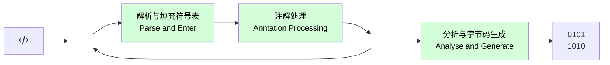
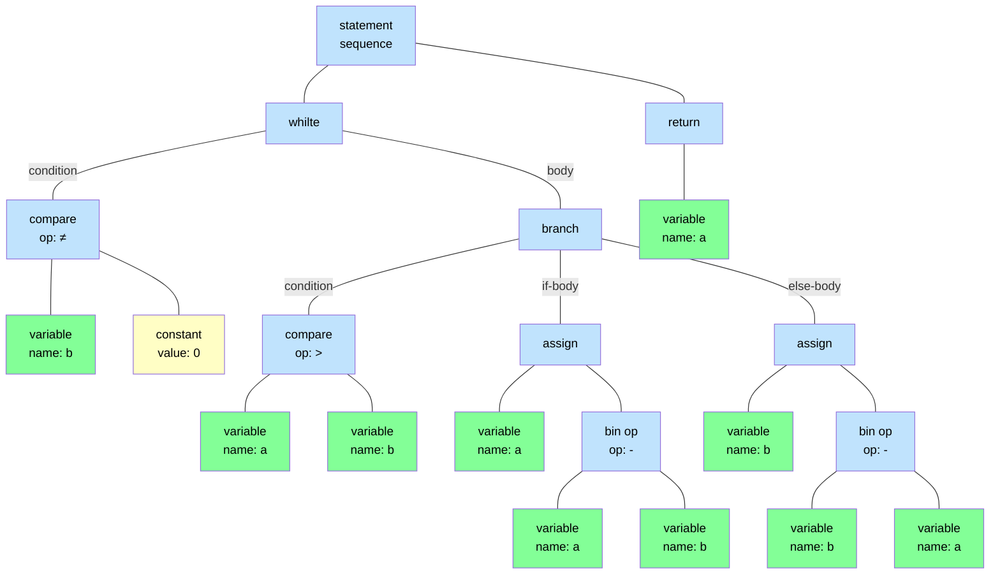
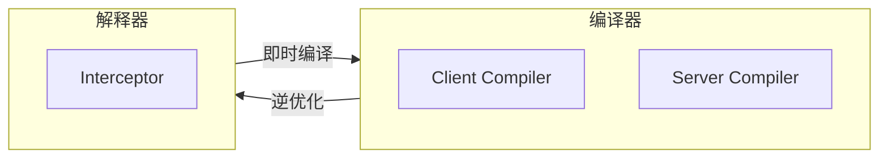

深入理解Java虚拟机系列——第4部分：程序编译与代码优化

1. 前端编译与优化
2. 后端编译与优化

<!--more-->

## 1. 前端编译与优化

比较有代表性的3类编译器产品：

- **前端编译器（编译器的前端）**：负责把java文件转变成class文件的过程，譬如：JDK的Javac、Eclipse JDT中的增量式编译器（ECJ）
- **即时编译器（JIT编译器）**：在运行期把字节码转变成本地机器码的过程，譬如：HotSpot虚拟机的C1、C2编译器，Graal编译器
- **提前编译器（AOT编译器）**：负责直接把程序编译成目标机器指令集相关的二进制代码的过程，譬如：JDK的Jaotc、GNU Compiler for the Java（GCJ）、Excelsior JET

### 1.1 📠 Javac编译器

#### Javac的源码与调试

从Javac代码的总体结构来看，编译过程大致可以分为1个准备过程和3个处理过程：

1. 准备过程：初始化插入式注解处理器
2. 解析与填充符号表过程，包括：
   - 词发、语法分析。将源代码的字符流转变为标记集合，构造出抽象语法树
   - 填充符号表，产生符号地址和符号信息
3. 插入式注解处理器的注解处理过程：
4. 分析与字节码生成过程，包括：
   - 标注检查，对语法的静态信息进行检查
   - 数据流及控制分析，对程序动态运行过程进行检查
   - 解语法糖，将江海代码编写的语法糖还原为原有的形式
   - 字节码生成，将前面各个步骤所生成的信息转化为字节码




#### 解析与填充符号表

**1. 词法、语法分析**

词法分析是将源代码的字符流转变为标记（Token）集合的过程，单个字符是程序编写时的最小元素，但标记才是编译时的最小元素。关键字、变量名、字面量、运算符都可以作为标记，如`int a=b+2`代码中就包含了6个标记。

语法分析是根据标记序列构造抽象语法树的过程，抽象语法树（Abstract Syntax Tree，AST）是一种用来描述程序代码语法结构的树形式的表达方式。抽象语法树的每一个节点都代表着程序代码中的一个语法结构（Syntax Construct），例如包、类型、修饰符、运算符、接口、返回值甚至连注释等都可以是一种特定的语法结构。




**2. 符号填充**

完成词法和语法分析的下一个阶段是对符号表进行填充的过程。

符号表（Symbol Table）是由一组符号地址和符号信息构成的数据结构（可以把它类比成哈希表中键值对的存储形式）。符号表总所登记的信息在编译的不同阶段都要被用到，譬如：

- 在语义分析的过程中，符号表所登记的内容将用于语义检查
- 在目标代码生成阶段，对符号名进行地址分配时，符号表是地址分配的直接依据

#### 注解处理器

JDK 5之后，Java语言提供了对注解（Annotations）的支持，在程序运行期间允许读取、修改、添加抽象语法树中额任意元素。

#### 语义分析与字节码生成

语义分析的主要任务是对结构上正确的源程序进行上下文相关性质的检查，譬如类型检查、控制流检查、数据流检查等。一般我们在IDE编码时看到红线标注的错误提示中，绝大部分来源于语义分析阶段的检查结果。

Javac在编译过程中，语义过程可分为标注检查和数据及控制流分析两个步骤：

**1. 标注检查**

标注检查步骤要检查的内容包括诸如变量使用前是否已被声明、变量与赋值之间的数据类型是否 能够匹配，等等。

**2. 数据及控制流分析**

数据流分析和控制流分析是对程序上下文逻辑更进一步的验证，它可以检查出诸如程序局部变量 在使用前是否有赋值、方法的每条路径是否都有返回值、是否所有的受查异常都被正确处理了等问题。

**3. 解语法糖**

语法糖（Syntactic Sugar）指在计算机语言中添加的某种语法，对语言的编译结果和功能并没有实际影响，但能更方便程序员使用该语言。

Java中最常见的语法糖包括**泛型**、**变长参数**、**自动装箱拆箱**等。由于Java虚拟机运行时并不直接支持这些语法，**它们在编译阶段被还原回原始的基础语法结构，这个过程就称为解语法糖**。

**4. 字节码生成**

字节码生成是Javac编译过程的最后一个阶段，主要把前面各个步骤生成的信息（语法树、符号表）转化成字节码指令写到磁盘。除此之外，编译器还进行了少量的代码添加和转换工作，譬如：

- 把字符串的加操作替换成StringBuffer或StringBuilder的`append()`操作
- 实例构造器`<init>()`方法和类构造器`<clinit>()`方法就是在这个阶段被添加到语法树中


### 1.2 🍬 Java语法糖的味道

#### 泛型

泛型的本质是参数化类型（Parameterized Type）或者参数化多态（Parametric Polymorphism）的应用，即可以将操作的数据类型指定为方法签名中的一种特殊参数，这种参数类型能够用在类、接口和方法的创建中，分别构成泛型类、泛型接口和泛型方法。

泛型让程序员能够针对泛化的数据类型编写相同的算法，这也是抽象的一种体现。

**1. Java与C#的泛型**

Java选择的泛型实现方式是*“类型擦除式泛型”（Type Erasure Generics）*，而C#选择的是*“具现化式泛型”（Reified Generics）*。

C#的泛型无论在程序源码、编译后的中间语言表示，抑或是运行期的CLR里，都是切实存在的，譬如`List<int>`与`List<string>`就是两个不同的类型，它们有着独立的虚方法表和类型数据。

而Java语言中的泛型只在程序源码中存在，在编译后的字节码文件中，全部泛型都会被替换为原来的*裸类型（Raw Type）*，并且在相应的地方插入了强制转型代码，因此对于运行期的Java来说，`ArrayList<int>`与`ArrayList<String>`是同一种类型。

Java的类型擦除式泛型无论在使用效果上还是运行效率上，几乎是全面落后于C#的具现化式泛型，而它的唯一优势是在于实现这种泛型的影响范围上：擦除式泛型的实现几乎只需要在Javac编译器上做出改进即可，不需要改动字节码、不需要改动Java虚拟机，也保证了以前没有使用泛型的库可以直接运行在Java 5.0之上。

**3. 类型擦除**

Java选择将已有的类型泛型化，譬如`ArrayList`泛型化后变成了`ArrayList<T>`，为了保证以前直接用`ArrayList`同时支持泛型化，就必须让所有的泛型化类型自动成为`ArrayList`的子类，这样才能保证类型转换是安全的。譬如：`ArrayList<Integer>`、`ArrayList<String>`。

由此就引出了**裸类型（Raw Type）**，被视为所有该类型泛化实例的共同父类型（Super Type），只有这样的赋值才是被系统允许的子类到父类的安全转型。

```java
ArrayList<Integer> ilist = new ArrayList<Integer>();
ArrayList<String> slist = new ArrayList<String>();
ArrayList list;	//裸类型
list = ilist;
list = slist;
```

裸类型的实现选择：

- 真实的构造出`ArrayList<Integer>`等这样的类型，并自动实现从`ArrayList<Integer>`派生自`ArrayList`的集成关系来满足裸类型的定义
- 在编译期把`ArrayList<Integer>`还原回`ArrayList`，只在元素访问、修改时自动插入一些强制类型转换的检查指令

下面通过一个案例来演示Java语言在类型擦除上的选择：

```java
public static void main(String[] args) {
  // 编译前
  Map<String, String> map = new HashMap<String, String>();
  map.put("hello", "你好");
  map.put("world", "世界");
  System.out.println(map.get("hello"));
  System.out.println(map.get("world"));
  // 编译后
  Map map = new HashMap();
  map.put("hello", "你好");
  map.put("world", "世界");
  System.out.println((String) map.get("hello"));
  System.out.println((String) map.get("world"));
}
```

类型擦除式泛型缺陷：

1. 对于原生类型（`int`、`long`、`double`、`float`等），在类型擦除再插入强制转型代码时无法支持，譬如：`int`、`long`不能与`Object`之间强制转型。所以Java给出的解决方案是用`ArrayList<Integer>`、`ArrayList<Long>`等包装类来替换原生基础类型。这样导致了无数构造包装类和装箱、拆箱的开销。也成为了Java泛型慢的主要原因。

2. 运行期无法获取泛型类型信息，原因由于运行期Java虚拟机无法取得泛型类型而导致。

   ```java
   public class TypeErasureGenerics<E> {
     public void doSomething(Object item) {
       if (item instanceof E) {	// 不合法，无法对泛型进行实例判断
         ...
       }
       E newItem = new E();		// 不合法，无法使用泛型创建对象
       E[] itemArray = new E[10];	// 不合法，无法使用泛型创建数组
     }
   }
   ```

#### 自动装箱、拆箱与遍历循环

泛型、自动装箱、自动拆箱、遍历循环与变长参数在编译后的变化：

```java
public static void main(String args[]) {
  List<Integer> list = Arrays.asList(1, 2, 3, 4);
  int sum = 0;
  for (int i : list) {
    sum += i;
  }
  System.out.println(sum);
}
```

```java
public static void main(String[] args) {
  List list = Arrays.asList( new Integer[] {
    Integer.valueOf(1), 
    Integer.valueOf(2),
    Integer.valueOf(3), 
    Integer.valueOf(4) 
  });
  
  int sum = 0;
  
  for (Iterator localIterator = list.iterator(); localIterator.hasNext(); ) {
    int i = ((Integer)localIterator.next()).intValue();
    sum += i;
  }
  System.out.println(sum);
}
```

包装类的`==`运算符在不遇到算数运算的情况下不会自动拆箱，以及它们的`equals()`方法不处理数据转型的关系。

```java
public static void main(String args[]) {
  Integer a = 1;
  Integer b = 2;
  Integer c = 3;
	Integer d = 3;
	Integer e = 321;
	Integer f = 321;
	Long g = 3L;
	System.out.println(c == d);		// true
	System.out.println(e == f);		// false
	System.out.println(c == (a + b));		// true
	System.out.println(c.equals(a + b));	// true
	System.out.println(g == (a + b));	// true
	System.out.println(g.equals(a + b));	// false
}
```

#### 条件编译

C/C++中使用预处理指示符`#ifdef`来完成条件编译，而Java使用的是条件为常量的`if`语句，这也是Java语言的一颗语法糖，根据布尔常量值的真假，编译器会将分支汇总不成立的代码块消除。

下面来看下条件语句编译后的结果：

````java
public static void main(String[] args) {
  if (true) {
    System.out.println("block 1");
  } else {
    System.out.println("block 2");
  }
}
````

```java
public static void main(String[] args) {
  System.out.println("block 1");
}
```


## 2. 后端编译与优化

如果把字节码看作是程序语言的一种中间表示形式（Intermediate Representation, IR）的话，编译器把Class文件转换成与本地基础设施（硬件指令集、操作系统）相关的二进制机器码，它都可以视为整个编译过程的后端。

### 2.1 📠 即时编译器

Java程序最初都是通过解释器（Interpreter）进行解释执行的（譬如：主流商用JVM：HotSpot、OpenJ9），当虚拟机发现某个方法或代码块的运行特备频繁时，为了提高热点代码的执行效率，在运行期会把这些代码编译成本地机器码，并以各种手段尽可能地进行代码优化，这种方法或代码块则称之为*“热点代码”（Hot Spot Code）*，运行期完成这个任务的后端编译器则称之为*即时编译器*。

#### 解释器与编译器

主流商用JVM：HotSpo、OpenJ9等，内部同事包含解释器与编译器，解释器与编译器两者各有优势：

- 当程序需要快速启动和执行时，解释器优先执行，目的：省去编译的耗时、立即运行
- 当程序启动后，随着时间推移，编译器逐渐发挥作用，把代码编译成本地代码，目的：减少解释器的中间损耗，获取更高的执行效率
- 当程序运行环境中内存资源限制较大时，使用解释器执行可以节约内存
- 解释器可以作为编译器激进优化时的后备“逃生门”




#### 编译对象与触发条件

前面提到的热点代码，主要的有两类，编译的目标对象都是整个方法体：

- 被多次调用的方法
  由于依靠方法调用触发的编译，编译器会以整个方法作为编译对象，这种编译也是虚拟机中标准的及时编译方式。
- 被多次执行的循环体
  热点代码作为方法的一部分，但编译器依然以整个方法作为编译对象，只是执行入口稍有不同，由于这种编译发生在方法执行的过程中，因此被称为*“栈上替换”（On Stack Replacement, OSR）*，即方法的栈帧还在栈上，方法就被替换了。

首先要知道是不是热点代码，是否需要触发即时编译，这个行为称为*“热点探针”（HotSpot Code Detection）*，主流的热点探针判定方式有两种：

- 基于采样的热点探针（Sample Based Hot Spot Code Detection）：周期性地检查各个线程的调用栈顶，如果经常出现在栈顶，判定为热点方法。
  - 优点：实现简单高效，较容易获取方法调用关系（将调用堆栈展开即可）
  - 缺点：很难精确地确认一个方法的热度，较容易因搜到线程阻塞或别的外界因素的影响而打乱热点探针
- 基于计数器的热点探针（Counter Based Hot Spot Code Detection）：为每个方法（甚至是代码块）建立计数器，统计方法的执行次数，超过一定阈值判定为热点方法。
  - 优点：统计结果相对更加精确严谨
  - 缺点：统计麻烦，需要建立并维护每个方法的计数，不能直接获取方法的调用关系

#### 编译过程

编译动作默认在后台的编译线程中进行。

**1. 客户端编译器**

对于客户端编译器来说，它是一个相对简单快速的三段式编译器，主要关注点在于局部性的优化，而放弃了很多耗时较长的全局优化手段：

- 第一阶段：一个平台独立的前端将字节码构造成一种*高级中间代码（Hight-Level-Intermediate Representation, HIR，即与目标机器指令集无关的中间表示）*来表示，HIR使用静态单分配（Static Single Assignment, SSA）的形式来代表代码值。
- 第二阶段：一个平台相关的后端从HIR中产生低级中间代码（Low-Level Intermediate Representation, LIR, 即与目标机器指令集相关的中间表示）来表示，在此之前会在HIR上完成一些优化，如：空值检查消除、范围检查消除等。
- 第三阶段：在平台相关的后端使用线性扫描算法（Linear Scan Register Allcation）在HIR上分配寄存器，并在LIR上做*窥孔（Peephole）*优化，然后产生机器代码。

客户端编译器大致的执行过程如下：


**2. 服务端编译器**

服务端编译器专为面向服务店典型应用场景二调整的，是一个能容忍很高优化复杂的的高级编译器，可以执行大部分景点的优化动作：

- 无用代码消除（Dead Code Elimination）
- 循环展开 （Loop Unrolling）
- 循环表达式外提（Loop Expression Hoisting）
- 消除公共子表达式（Common Subexpression Elimination）
- 常量传播（Constant Propagation）
- 基本块重排序（Basic Block Reordering）
- ...

还会实施一些与Java语言特性密切相关的优化技术：

- 范围检查消除（Range Check Elimination）
- 空值检查消除（Null Check Elimination）
- ...

另外，还可根据解释器客户端编译器提供的性能监控信息，进行一些不稳定的预测性激进化优化：

- 如守护内联（Guarded Inlining）
- 分支频率预测 （Branch Frequency Prediction）
- ...

服务端编译采用的寄存器分配器是一个全局图着色分配器，它可以充分利用某些处理器架构（如 RISC）上的大寄存器集合。


### 2.2 📠 提前编译

#### 提前编译的优劣得失

提前编译产品有着两条明显的分支：

**1. 传统的提前编译应用形式**

与传统C/C++编译器类似的，在运行前把程序代码编译成机器码的静态翻译工作。

这一类形式主要解决即时编译器的最大弱点：占用程序运行时间和运算资源。

**2. 提前缓存加速的应用形式**

把原本即时编译在运行时要做的编译工作提前做好并保存下来，下次运行到这些代码时直接加载使用。
本质是给即时编译器做缓存加速，改善Java程序的启动时间，以及需要一段时间预热后才能达到高性能的问题。这种提前编译被称为**动态提前编译（Dynamic AOT）**或者**即使缓存（JIT Cacheing）**。

尽管即时编译在时间和运算资源方面的劣势无法忽视，但即时编译依然有自己的优势，这种天然优势是：

- **性能分析制导优化（Profile-Guided Optimization，PGO）**
  收集性能监控信息，譬如：某个程序 点抽象类通常会是什么实际类型、条件判断通常会走哪条分支、方法调用通常会选择哪个版本、循环 通常会进行多少次等。
- **激进预测性优化（Aggressive Speculative Optimization）**
- **链接时优化（Link-Time Optimization，LTO）**


### 2.3 📈 编译器优化技术

编译器的目标虽然是做由程序代码翻译为本地机器码的工作，但其实难点并不在于能不能成功翻译出机器码，输出代码优化质量的高低才决定编译器优秀是否的关键。

即时编译器优化技术之中，分别看下四项具有代表性的优化技术的运作过程：

- 最重要的优化技术之一：方法内联
- 最前沿的优化技术之一：逃逸分析
- 语言无关的经典优化技术之一：公共子代表式消除
- 语言相关的景丹优化技术之一：数组边界检查消除

#### 方法内联

方法内联的主要有两个目的：一是**去除方法调用的成本（如查找方法版本、建立栈帧等）**，二是**为其它优化手段建立良好的基础**，如果没有内联，多数其它优化都无法有效进行。

```java
public int test(int x) {
  int xx = x + 2;
  Point p = new Point(xx, 42);
  return p.getX();
}
```

内联后

```java
public int test(int x) {
  int xx = x + 2;
  Point p = point_memory_alloc();	// 在堆中分配P对象的示意方法
  p.x = xx;		// Point构造函数被内联后的样子
  p.y = 42;
  return p.x;	// Point::getX()被内联后的样子
}
```

#### 逃逸分析

逃逸分析（Escape Analysis）与类型继承关系分析一样，并不是直接优化代码的手段，而是**为其它优化措施提供依据的分析技术**。

逃逸分析的基本原理：**分析对象动态作用域，当一个对象在方法里被定义后，它可能被外部方法所引用**，按逃逸程度由低到高可以区分为：

- **不逃逸**
- **方法逃逸**：作为调用参数传递到其他方法中
- **线程逃逸**：赋值给其他线程中访问的实例变量

然后按照不同程度的逃逸，采取不同程度的优化，如：

- 栈上分配（Stack Allocations）
- **标量替换（Scalar Repacement）**：若一个数据已经无法再分解成更小的数据（int、long、reference等），那么这些数据就可以被称为**标量**。相对的，**如果一个数据可以继续分解，根据程序访问的情况，将其用到的成员变量回复为原始数据类型来访问，这个过程就称为标量替换**。
- 同步消除（Synchronization Elimination）

接着前面内联后代码，进行逃逸分析，发现整个`test()`方法内Point对象实例不会发生任何程度的逃逸，这样可以对它进行标量替换优化:

```java
public int test(int x) {
  int xx = x + 2;
  int px = xx;
  int py = 42;
  return px;
}
```

接着，通过数据流分析，发现`py`的值对方法不会造成任何影响，就可以去做无效代码消除：

```java
public int test(int x) {
  return x + 2;
}
```

#### 公共子表达消除

公共子表达式消除是一项非常经典的、普遍应用于各种编译器的优化技术，它的含义是：**如果一个表达式E之前已经被计算过了，并且从先前的计算到现在E中所有变量的值都没有发生变化，那么E的这次出现就称为公共子表达式**。

```java
int d = (c * b) * 12 + a + (a + b * c);
```

公共子表达式优化后：

```java
int d = E * 12 + a + (a + E);
```

接着，编译器还可能进行另外一种优化——*代数简化（Algebraic Simplification）*，在E的乘法运算基础上，把表达式变为：

```java
int d = E * 13 + a + a;
```

#### 数组便捷检查消除

数组边界检查消除（Array Bounds Checking Elimination）在Java语言中访问数组元素时，即时编译器会自动进行上下界范围检查，否则抛出运行时异常`java.lang.ArrayIndexOutBoundsException`，对于开发展来说是一件友好的事情，但对于虚拟机的执行子系统是一种性能负担。

为了消除这种隐式的开销，数组边界检查优化尽可能把运行期检查提前到编译器完成。例如：

1. `foo[3]`的数组下标是常量，只要编译期根据*数据流分析*来确定foo.lenght的值，并半段下标没有越界，执行的时候就无需判断了。
2. 数组访问发生在循环之中，编译器通过*数据流分析*就可以判定循环变量的取值范围永远在区间`[0, foo.length)`之内，那么循环中就可以把整个数组的上下界检查消除。

除此之外，还有一种避开的处理思路——隐式异常处理：

```java
if (foo != null) {
  return foo.value;
} else {
  throw new NullPointException();
}
```

隐式异常优化后，虚拟机会把代码表示的访问过程变为如下伪代码：

```java
try {
  return foo.value;
} catch (segment_fault) {		// Segment Fault信号的异常处理器
  uncommon_trap();
}
```


参考文献：

[深入理解Java虚拟机：JVM高级特性与最佳实践（第3版）—周志明](https://read.douban.com/ebook/128052544/)

> 「深入理解JVM」系列为阅读笔记，如有侵权请第一时间联系删除， 谢谢！
>
> <mcgrady911@foxmail.com>
