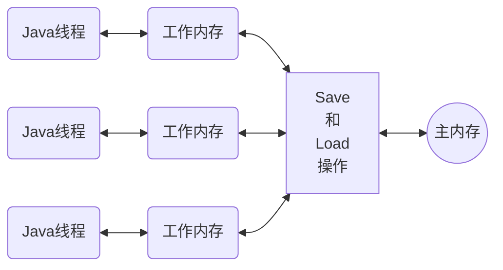
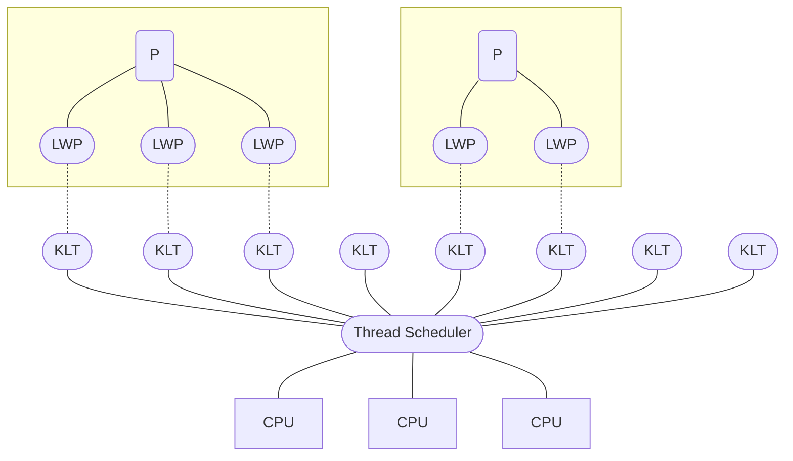
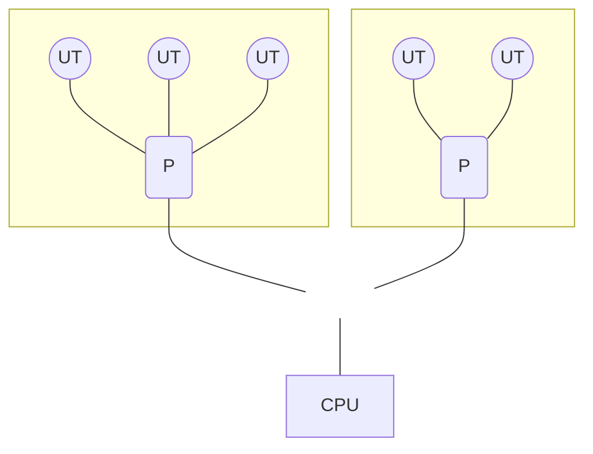
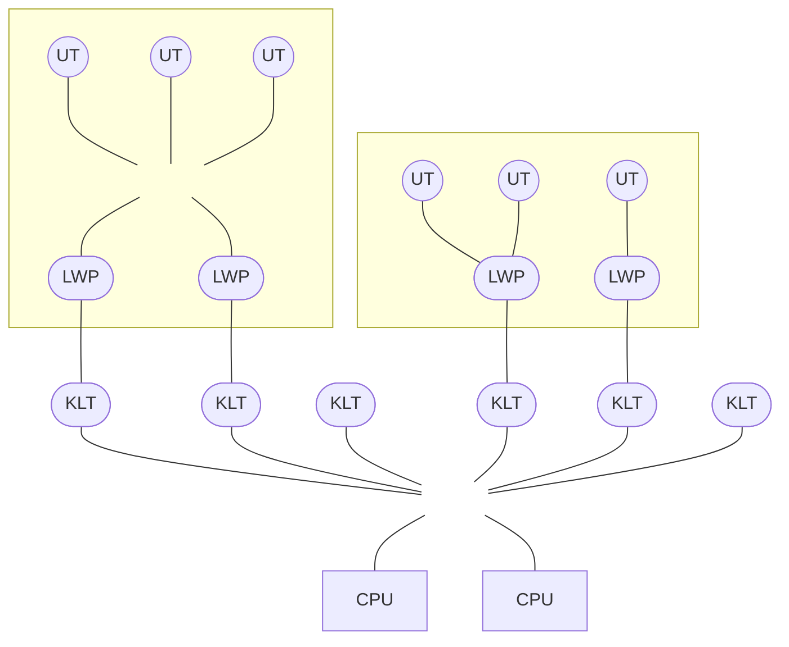
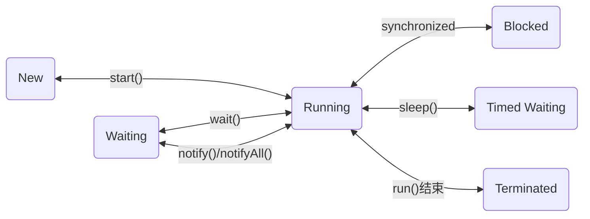

深入理解Java虚拟机系列——第5部分：高效并发

1. Java内存模型与线程
2. 线程优化与锁优化

<!--more-->

## 1. Java内存模型与线程

### 1.1 🗄 Java内存模型

在《Java虚拟机规范》中定义了一种Java内存模型（Java Memory Model, JMM）来屏蔽各种硬件和操作系统的内存访问差异，以实现Java程序在各种平台都能达到一致的内存访问效果。

#### 主内存与工作内存

Java内存模型的主要目的是**定义程序中各种变量（实例字段、静态字段和构成数组对象的元素）的访问规则**。

Java内存模型规定了：

- 所有的变量都存储在主内存（Main Memory）
- 每条线程有自己的工作内存（Working Memory），存储了被该线程使用的变量的主内存副本。
- 线程对变量的所有操作都必须在工作内存中进行，而不能直接读写主内存中的数据。
- 不同线程之间也无法直接访问对方工作内存中的变量，线程间变量值的 传递均需通过主内存来完成。

以下是线程、主内存、工作内存三者的交互关系：



#### 内存交互操作

一个变量如何从主内存拷贝到工作内存、如何从 工作内存同步回主内存这一类的实现细节，Java内存模型中定义了以下8种操作来完成：

- **lock（锁定）**：作用于主内存的变量，把一个变量标识为一条线程独占的状态。
- **unlock（解锁）**：作用于煮内存的变量，把一个处于锁定状态的变量释放，释放后的变量才可以被其他线程锁定。
- **read（读取）**：作用于主内存的变量，把一个变量的值从内存传输到线程的工作内存中，以便随后的`load`动作使用。
- **load（载入）**：作用于工作内存的变量，把`read`操作从主内存中得到的变量值放入工作区内存的变量副本中。
- **use（使用）**：作用于工作内存的变量，把工作内存中一个变量的值传递给执行引擎，每当虚拟机遇到一个需要使用变量的值的字节码指令时将会执行这个操作。
- **assign（赋值）**：作用于工作内存的变量，把一个从执行引擎接收的值赋给工作内存的变量， 每当虚拟机遇到一个给变量赋值的字节码指令时执行这个操作。
- **store（存储）**：作用于工作内存的变量，把工作内存中一个变量的值传送到主内存中，以便随后的`write`操作使用。
- **write（写入）**：作用于主内存的变量，它把`store`操作从工作内存中得到的变量的值放入主内存的变量中。

以上Java虚拟机实现的每一种操作都是**原子的**、**不可再分的**。

举例，对主内存中的变量`a`、`b`进行访问时，一种可能出现的顺序是：


#### 对于volatile型变量的特殊规则

**volatile关键字是Java虚拟机提供的轻量级的同步机制**。

在某些情况下，`volatile`的同步机制性能要优于锁（`synchronized`、`java.util.concureent` 中的锁或原子类），`volatile`变量读操作的性能消耗与普通变量几乎没有差别，写操作上则可能会慢一些，即便如此，大多数场景下`volatile`的总开销仍然比锁来得更低。

Java内存模型为`volatile`专门定义了一些特殊的访问规则：

**1. 可见性**

保证此变量对所有线程的*“可见性”*，可见性是指当一条线程修改了这个变量的值，新值对于其他线程来说是可以立即知道的。而普通变量并不能做到这一点，普通变量的值在线程间传递时均需要通过主内存来完成。

虽然`volatile`变量在各个线程中是一致的，但**Java里的运算操作符并非原子操作**，导致了`volatile`变量在运算的并发下是不安全的。

由于`volatile`变量只能保证可见性，在不符合以下两条规则的运算场景中，我们仍然要通过加锁（`synchronized`、`java.util.concureent` 中的锁或原子类）来保证原子性：

- 运算结果并不依赖变量的当前值，或者能保证只有单一的线程修改变量的值
- 变量不需要与其他的状态变量共同参与不变约束

**2. 禁止指令重排序优化**

使用`volatile`变量的语义是禁止指令重排序优化，普通的变量仅会保证在该方法的执行过程中所有依赖赋值结果的地方都能获取到正确的结果，而**不能保证变量赋值操作的顺序与程序代码中的执行顺序一致**。

从硬件架构上来讲，指令重排是指处理器采用了允许将多条指令不按程序规定的顺序分开发送给各个相应的电路单元进行处理。

#### 针对long和double型变量的特殊规则

相对于Java内存模型定义的8种具有原子性的操作，64位的数据类型（`long`/`double`）在模型中特别定义了一条宽松的规定：**允许虚拟机将没有被`volatile`修饰的64位数据的读写操作划分为两次32位的操作来进行**，即允许虚拟机实现自行选择是否要保证64位数据类型的`load`、`store`、`read`、`write`这四个操作的原子性，这就是所谓的*`long`和`double`的非原子性协定（Non-Atomic Treatment of double and long Variables）*。

#### 原子性、可见性与有序性

**1. 原子性（Atomicity）**

基本数据类型的访问、读写都是具备原子性的（例外：`long`/`double`）。

Java内存模型提供了`lock`和`unlock`操作来满足更大范围的原子性保证，对于用户使用，还提供了更高层次的字节码指令`monitorenter`和`monitorexit`来隐式地使用这两个操作，Java中的`synchronized`同步块具备的原子性操作，就是这两个字节码指令来完成的。

**2. 可见性（Visibility）**

可见性指当一个线程修改了共享变量的值时，其他线程能够立即得知这个修改。

Java内存模是通过在变量修改后将新值同步回主内存，在变量读取前从主内存刷新变量值这种依赖主内存作为传递媒介的方式来实现可见性的。

`volatile`的特殊规则保证了新值能立即同步到主内存，以及每次使用前立即从主内存刷新，因此`volatile`保证了多线程操作时变量的可见性，而普通变量则不能保证这一点。

除了`volatile`之外，Java还提供了两个关键字能实现可见性：

- **`final`**：被`final`修饰的字段在构造器中一旦被初始化完成，并且构造器没有把"this"的引用传递出去，那么在其他线程中就能看见`final`字段的值。
- **`synchronized`**：同步块的可见性是由：对一个变量执行unlock操作之前，必须先把此变量同步回主内存中（执行`store`、`write`操作）这条规则获得。

**3. 有序性（Ordering）**

*如果在本线程内观察，所有的操作都是有序的；如果在一个线程中观察另一个线程，所有的操作的都是无序的。*

Java语言提供了`volatile`和`synchronized`两个关键字来保证线程之间操作的有序性，`volatile`关键字本身就包含了禁止指令重排的语义，而`synchronized`则是由*“一个变量在同一时刻只允许一条线程对其进行lock操作”*这条规则获得，这个规则决定了**持有同一个锁的两个同步块只能串行地进入**。

#### 先行发生原则

先行发生（Happens-Before）原则：判断根据是否存在竞争，线程是否安全的非常有用的手段。

先行发生是Java内存模型中定义的两项操作之间的偏序关系。

下面来介绍下Java内存模型中的一些先行发生关系：

- **程序次序规则（Program Order Rule）**：在一个线程内，按照控制流顺序，书写在前面的操作先行发生于书写在后面的操作。

  > 注意：这里说的是控制流顺序而不是程序代码顺序，因为要考虑分支、循环等结构。

- **管程锁定规则（Monitor Lock Rule）**：一个`unlock`操作先行发生于后面对同一个锁的`lock`操作。

  > 注意：这里必须强调的是“同一个锁”，而“后面”是指时间上的先后。

- **volatile变量规则（Volatile Variable Rule）**：对于一个`volatile`变量的写操作先行发生于后面对这个变量的读操作。

  > 这里的“后面”同样是指时间上的先后。

- **线程启动规则（Thread Start Rule）**：`Thread::start()`方法先行发生于此线程的每一个动作。 

- **线程终止规则（Thread Termination Rule）**：线程中的所有操作都先行发生于对此线程的终止检测，我们可以通过`Thread::join()`方法是否结束、`Thread::isAlive()`的返回值等手段检测线程是否已经终止执行。

- **线程中断规则（Thread Interruption Rule）**：对线程`interrupt()`方法的调用先行发生于被中断线程的代码检测到中断事件的发生，可以通过`Thread::interrupted()`方法检测到是否有中断发生。

- **对象终结规则（Finalizer Rule）**：一个对象的初始化完成（构造函数执行结束）先行发生于它的`finalize()`方法的开始。

- **传递性（Transitivity）**：如果操作A先行发生于操作B，操作B先行发生于操作C，那就可以得出操作A先行发生于操作C的结论。


### 1.2 ☕️ Java与线程

实现线程主要由三种方式：

**1. 内核线程实现（1:1实现）**

**内核线程（Kernel-Level Thread, KLT）就是直接由操作系统内核支持的线程**，由内核通过操纵调度器（Scheduler）对线程进行调度来完成线程切换，并负责线程的任务映射到各个处理器上（每个内核线程可以视为内核的一个分身），可以让操作系统同时处理多件事情，这种支持多线程的内核就称为*多线程内核（Multi-Threads Kernel）*。

我们通常意义上所指的程序上使用的线程是指，*轻量级进程（Light Weight Process, LWP）*是内核线程的一种高级接口；这种轻量级进程与内核线程之间的关系为1:1的线程模型：



**2. 用户线程实现（1:N实现）**

广义上讲，一个线程只要不是内核线程，都可以认为是*用户线程（User Thread, UT）*的一种，而狭义上的用户线程指的是**完全建立在用户空间的线程库上**，用户线程的建立、同步、销毁和调度完全在用户态中完成，不需要内核的帮助。这种进程与用户线程之间1:N的关系称为一对多的线程模型：



用户线程的优势在于不需要系统内核支援，同时也是劣势，用户程序需要处理线程的创建、销毁、切换和调度问题，除有明确需求外，一般不会使用它。

**3. 用户线程加轻量级进程混合实现（N:M实现）**

这种混合模式下，即存在用户线程，也存在轻量级进程。轻量级进程作为用户线程和内核线程之间的桥梁，这样可以使用内核线程提供的线程调度功能及处理器映射，同时也降低了整个进程被完全阻塞的风险。用户线程与轻量级进程的数量是不定的，关系是N:M的多对多线程模型：



**4. Java线程的实现**

首先，Java线程的具体实现不受《Java虚拟机规范》的约束，从JDK 1.3起，“主流商用”的Java虚拟机模型普遍基于操作系统原生线程模型来实现，即采用1:1的线程模型。

#### Java线程调度

**线程调度是指系统为线程分配处理器使用权的过程**，调度方式主要有两种：

**1. 协同式（Cooperative Threads-Scheduling）线程调度**

协同式线程调度的多线程系统，线程的执行时间由线程本身来控制，线程工作执行完有义务主动通知系统切换到另一个线程。好处是实现简单，一般不会有线程同步问题，但坏处也很明显，线程执行时间不可控，甚至线程的代码编写有问题，一直不通知系统切换线程，那么程度会一直阻塞，有可能导致整个系统崩溃。

**2. 抢占式（Preemptive Threads-Scheduling）线程调度**

抢占式调度的多线程系统，每个线程将由系统来分配执行时间，线程的切换不由线程本身决定。优点是不会出现一个线程导致整个进程甚至系统阻塞的问题。

Java使用的线程调度方式就是抢占式调度，虽然由系统来自动完成线程调度，但开发者仍可以“建议”操作系统或多或少的分配执行时间的操作——这项操作是通过设置线程优先级来完成的， 但并不是一项稳定的调节手段。

Java共设置了10个级别的线程优先级（`Thread.MIN_PRIORITY`~`Thread.MAX_PRIORITY`），两个线程同时处于`Ready`状态时，优先级越高的线程越容易被系统选中执行。

#### 状态转换

Java语言定义了6种线程状态，**任意时间点中，一个线程有且只有其中一种状态，并可以通过特定的方法在不同状态之间转换**。

- **新建（New）**：创建后尚未启动的线程
- **运行（Running）**：包括操作系统状态中的`Running`和`Ready`，处于此状态的线程有可能正在执行，也有可能正在等待操作系统为它分配执行时间。
- **无限期等待（Waiting）**：不会被分配处理执行时间的线程，等待被其他线程显式唤醒。以下方法会让线程陷入无限期的等待状态：
  - 没有设置Timeout参数的`Object::wait()`
  - 没有设置Timeout参数的`Thread::join()`
  - `LockSupport::park()`
- **限期等待（Timed Waiting）**：不会被分配处理执行时间的线程，但无需等待其他线程显式唤醒，在一定时间后由系统自动唤醒。以下方法会让线程进入限期等待状态：
  - `Thread::slepp()`
  - 设置了Timeout参数的`Object::wait()`
  - 设置了Timeout参数的`Thread::join()`
  - `LockSupport::parkNanos()`
  - `LockSupport::parkUntil()`
- **阻塞（Blocked）**：被阻塞的线程，该状态下的线程在等待着获取到一个**排它锁**，这个事件在另外一个线程放弃这个锁的时候发生。
- **结束（Terminated）**：已终止或已结束执行线程的状态。



 

### 1.3 ☕️ Java与协程

#### 内核线程的局限

引言：*为什么内核线程调度切换成本要更高？*

内核线程的调度成本主要来自于**用户态与核心态之间的状态转换**，而这两种转换的开销主要来自于**响应中断**、**保护和恢复执行现场**的成本。


#### 协程的复苏

由于最初多数的用户线程是被设计成*协同式调度（Cooperative Scheduling）*的，所以它有一个别叫——*协程（Coroutine）*。

- 会完整地做调用栈的保护、恢复工作的被称为*“有栈协程”（Stackfull Coroutine）*。
- *“无栈协程”（Stackless Coroutine）*本质上是一种有限状态机，状态保存在闭包里，自然比有栈协程恢复调用要轻量得多，但功能上也相对有限。

协程的主要优势是**轻量**，当然也有它的局限，就是需要再应用层面实现的内容（调用栈、调度器）比较多。


## 2. 线程安全与锁优化

引言：*对于“高效并发”来说，首先要保证并发的正确性，然后在此基础上来实现高效。*

### 2.1 🛡 线程安全

定义：当多个线程同时访问一个对象时，如果不用考虑这些线程在运行时环境下的调度和交替执行，在不需要进行额外的同步，或者在调用方进行任何其他的协调操作，调用这个对象的行为都可以获得正确的结果，那就称这个对象是线程安全的。

#### Java语言中的线程安全

Java语言中各种操作共享的数据分为以下五类：

**1. 不可变**

不可变（Immutable）的对象一定是线程安全的，无论是对象的方法实现还是方法的调用者，都不需要再进行任何线程安全保障措施。

**2. 绝对线程安全**

绝对的线程安全的定义：一个类要达到“不管运行时环境如何，调用者都不需要任何额外的同步措施”；如果是要实现这一定义，有可能需要付出非常昂贵的，甚至不切实际的代价。

**3. 相对线程安全**

相对线程安全即我们通常意义上所讲的线程安全，它需要保证对这个对象单次的操作是线程安全的，我们在调用的时候不需要进行额外的保障措施，但是对于一些特定顺序的连续调用，就可能需要在调用端使用额外的同步手段来保证调用的正确性。

**4. 线程兼容**

线程兼容是指对象本身并不是线程安全的，但是可以通过在调用端正确地使用同步手段来保证对象在并发环境中可以安全地使用。Java类库API中大部分的类都是现成兼容的。

**4. 线程对立**

线程对立是指不管调用端是否采取了同步措施，都无法在多线程环境中并发使用代码。

譬如：Thread类的`suspend()`和`resume()`方法，如果有两个线程同时持有一个线程对 象，一个尝试去中断线程，一个尝试去恢复线程，在并发进行的情况下，无论调用时是否进行了同 步，目标线程都存在死锁风险；也正是这个原因，`suspend()`和`resume()`方法都已经被声明废弃了。

#### 线程安全的实现方法

**1. 互斥同步**

**互斥同步（Mutual Exclusion & Synchronization）**是一种最常见的也是最主要的并发正确性保障手段。**同步是指在多个线程并发访问共享数据时，保证共享数据在同一个时刻只被一条（或者是一些， 当使用信号量的时候）线程使用**。而**互斥是实现同步的一种手段，临界区（Critical Section）、互斥量 （Mutex）和信号量（Semaphore）都是常见的互斥实现方式**。因此在“互斥同步”这四个字里面，互斥 是因，同步是果；互斥是方法，同步是目的。

在Java里面，最基本的互斥同步手段就是`synchronized`关键字，这是一种*块结构（Block Structured）*的同步语法；经过Javac编译之后，会在同步块的前后分别形成`monitorenter`和`monitorexit`这两个字节码指令。这两个指令都需要一个`reference`类型的参数来指明要锁定和解锁的对象。如果明确指定了对象参数，那就以这个对象的引用作为`reference`；如果没有明确指定，那将根据`synchronized`修饰的方法类型（如实例方法或类方法），来决定是取代码所在的对象实例还是取类型对应的Class对象来作为线程要持有的锁。

由于Java的线程是映射到操作系统的原生内核线程之上的，所以从执行成本的角度来看，**持有锁是一个重量级（Heavy-Weight）的操作**。

互斥同步面临的主要问题是进行线程阻塞和唤醒所带来的性能开销，因此这种同步也被称为***阻塞同步（Blocking Synchronization）***。

**2. 非阻塞同步**

基于冲突检测的乐观并发策略——**不管风险，先进行操作，如果没有其他线程争用共享数据，那操作就直接成功了；如果共享的数 据的确被争用，产生了冲突，那再进行其他的补偿措施，最常用的补偿措施是不断地重试，直到出现 没有竞争的共享数据为止**。

这种乐观并发策略的实现不再需要把线程阻塞挂起，因此这种同步操作被称为*非阻塞同步（Non-Blocking Synchronization）*。

Java中提供这种策略的类库有：

- `sun.misc.Unsafe`里的`compareAndSwapInt()`和`compareAndSwapLong()`等方法。
- VarHandle类
- AtomicInteger和AtomicLong

**3. 无同步方案**

同步知识保障存在共享数据征用时正确性的手段，如果能让一个方法本来就不涉及共享数据，那它自然就不需要任何同步措施去保证期其正确性，因此会有一些代码天生就是线程安全的，譬如以下两类：

- **可重入代码（Reemtramt Code）**：指可以在代码执行的任何时刻中断它，转而去执行另外一段代码，而在控制权返回后，原来的程序不会出现任何错误，也不会对结果有所影响；即保证了代码的线程安全，所以**可重入的代码都是线程安全的**。
- **线程本地存储（Thread Local Storage）**:Java中如果一个变量只要被某个线程独享，可以通过ThreadLocal类来实现线程本地存储的功能。
  每一个线程的Thread对象中都 有一个ThreadLocalMap对象，这个对象存储了一组以`ThreadLocal.threadLocalHashCode`为键，以本地线程变量为值的K-V值对，ThreadLocal对象就是当前线程的ThreadLocalMap的访问入口，每一个 ThreadLocal对象都包含了一个独一无二的`threadLocalHashCode`值，使用这个值就可以在线程K-V值对中找回对应的本地线程变量。


### 2.2 🔒 锁优化

为了在线程间更高效地共享数据及解决竞争问题，从而提高程序的执行效率，出现了各种锁优化技术：

#### 自旋锁与自适应自旋

在许多共享数据的锁定状态只会持续很短的时间，为了这段时间去挂起和恢复线程并不值得。在现代大多数物理机器都有多路处理器或多个处理器核心情况下，可以让请求锁的线程不放弃处理器执行时间，也就是不执行线程挂起和恢复操作，只是让线程执行一个忙循环（自旋）来等待持有锁的线程是否很快释放锁——这项技术就是所谓的自旋锁。

自适应的自旋意味着自旋的时间不再是固定的了，而是由前一次在同一个锁上的自旋时间及锁的拥有者的状态来决定的。

#### 锁消除

锁消除是指**虚拟机即时编译器在运行时，对一些代码要求同步，但是对被检测到不可能存在共享数据竞争的锁进行消除**。锁消除的主要判定依据来源于逃逸分析的数据支持，如果判断到一段代码中，在堆上的所有数据都不会逃逸出去被其他线程访问到，那就可以把它们当作栈上数据对待，认为它们是线程私有的，同步加锁自然就无须再进行。

#### 锁粗化

原则上，总是应将同步块的作用范围限制得尽可能小——只在共享数据的实际作用域中才进行同步。这样是为了使得需要同步的操作数量尽可能变少，即使存在锁竞争，等带锁的线程也能尽可能快地拿到锁。

但是如果一系列的连续操作都对同一个对象反复加锁和解锁，甚至加锁操作出现在循环体中，即使没有线程竞争，频繁地进行互斥同步操作也会导致不必要的性能损耗；当虚拟机探测到这种行为时，会把加锁同步的返回扩展（粗化）到整个操作序列的外部，进行优所谓的锁粗化。譬如：

```java
public String concatString(String s1, String s2, String s3) {
  StringBuffer sb = new StringBuffer();
  sb.append(s1);
  sb.append(s2);
  sb.append(s3);
  return sb.toString();
}
```

也就是扩展到第一个`append()`操作之前直至最后一个`append()`操作之后，这样只需要加锁一次就可以了。

#### 轻量级锁

轻量级锁的加入是在没有多线程竞争的前提下，减少传统的重量级锁使用操作系统互斥量产生的性能消耗。

当没有竞争时，轻量级锁便通过CAS[^CAS]操作避免了使用互斥量的开销；但如果存在锁竞争，除了互斥量的本身开销外，还额外发生了CAS[^CAS]操作的开销，因此在哦与竞争的情况下，轻量级锁反而会比传统的重量级锁更慢。即：轻量级锁能提升程序同步性能的依据是*“对于绝大部分的锁，在整个同步周期内都不是存在竞争的”*这一法则。

#### 偏向锁

偏向锁的目的是消除数据在无竞争情况下的同步源语，进一步提高程序的运行性能。相较于轻量级锁，偏向锁就是在无竞争的情况下把整个同步都消除掉，连CAS[^CAS]操作都不去做了。


参考文献：

[深入理解Java虚拟机：JVM高级特性与最佳实践（第3版）—周志明](https://read.douban.com/ebook/128052544/)

> 「深入理解JVM」系列为阅读笔记，如有侵权请第一时间联系删除， 谢谢！
>
> <mcgrady911@foxmail.com>


[^CAS]: 比较并交换指令（Compare-and-Swap）
